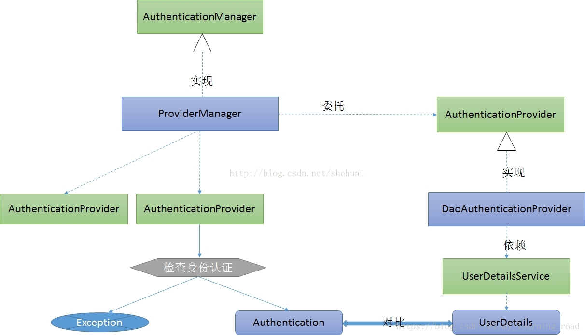

# 面试

## 阿里一面

1. 项目有没有做了当前rpc框架没有做到的事

2. 项目为甚么选择zookeeper

   1. zookeeper是基于CP（强一致性和分区容错性），CAP（一致性、可用性、分区容错性）
   2. BASE（基本可用、软状态、最终一致性）由CAP发展而来：核心思想在于即使无法做到强一致性，也要做到最终一致性，也是堆AP理论的补充
   3. mysql、redis和eureka都没有保证一致性

3. zookeeper是如何做到分布式一致性的

   1. 基于ZAB协议，实现了主备模式的系统架构，由单一进程处理客户端事务请求
   2. 单一进程成为leader，leader转换客户端请求为proposal，并把其发送到各个follower，当超过半数foller同意后，leader再次向follower服务器分发commit要求其提交proposal

4. 怎么保证消费者拿到的跟生产者生产的一致性

   1. watcher机制，生产者改变ip信息，及时通知订阅了的消费者信息更改

5. 学习过程中有没有遇到甚么困难

6. Object有哪些方法

7. 面向对象三大特性

8. Arraylist和linkedlist区别

9. 接口和抽象类

10. 线程的同步和调度

    1. 同步
       1. wait()、notify(),配合synchroized使用
    2. 调度
       1. Sleep()、join()、interrup()、

11. 实现线程的几种方法（拉胯）

    1. 继承Thread重写run
    2. 实现Runnable接口

12. static修辞字段和没有修辞

13. jvm的内存区域

14. jvm的堆的空间

15. mysql几种索引

16. 乐观锁和悲观锁

    1. 乐观锁大多采用数据版本机制MVCC，配合CAS解决ABA问题
    2. 悲观锁：mysql的 for update语句

17. redis为社么快

    1. 完全基于内存
    2. 数据结构简单优秀，redis自己专门设计了数据结构如跳表等
    3. 单线程
    4. 多路I/O复用

18. redis的rdb和aof

19. redis建立高性能集群

    1. 

    2. Gossip协议的基本工作原理就是：节点彼此不断通信交换信息，一段时间后所有的节点都会知道集群完整的信息，有点类似于流言传播。

       集群中的每个节点通过一定规则挑选要通信的节点，每个节点可能知道全部节点，也可能仅知道部分节点，只要这些节点彼此可以正常通信，最终它们会达到一致的状态。

       gossip协议的好处是元数据的更新比较分散，不是集中在一个地方，这样降低了单节点的请求压力。缺点是元数据更新有延时，可能导致集群的一些操作会有一些滞后。

    3. 客服端访问规则

       1. 

20. 有没有阅读过框架源码（spring的模版和创建bean）

21. spring注入的几种例子

    1. autowire注入
    2. set方法注入
    3. 构造方法注入

22. 知道cdn原理吗

    1. 为了加速网站访问
    2. 需要服务商配合
    3. 主要依靠dns解析
    4. 首先用户经过本地dns系统解析转到cdn专用dns服务器
       1. cdn的dns服务器向cdn的全局负载均衡设备发送url请求
       2. 负载均衡根据用户ip返回一个所属区域的服务器ip
       3. 用户请求该ip获取资源


## 京东一面

1. 问了我3年前的实习项目，忘都忘完了
2. 项目如何实现服务注册和服务消费
3. 问难点 回答心跳机制和半包沾包
4. 问客服端如何知道服务器关闭
5. 问客户端怎么重启
   1. 用schedule延时10秒左右线程去执行客户端的连接,貌似不需要
6. java异常分类
   1. Exception和Error
      1. Exception能够捕获，Error不能捕获如OOM
   2. Exception有分为受检查异常和不受检查异常
      1. 受检查异常必须要catch或者throws才能编译通过
      2. RuntimeExcetion的子类都为不受检查如空指针、数组越界、类型转换错误、算数错误
7. 问使用过哪些中间件
8. redis对输入限制
   1. key和string的value限制为512MB
9. redis底层 答sds和skiplist
10. redis类型


## WAYZ科技一面

1. 红黑树与二叉树区别

   1. **红黑树有几种特性：**

      ​    **1.每个节点只能是红色或者黑色。**

      ​    **2.根节点必须是黑色。**

      ​    **3.红色的节点，它的叶节点只能是黑色。**

      ​    **4.从任一节点到其每个叶子的所有路径都包含相同数目的黑色节点。**

   2. 红黑树（没有规定叶子节点的高度差不大于1）：

      　　1红黑树只追求近似平衡，所以在插入与删除节点时，翻转次数远远少于平衡树，因此在需要较多插入删除操作的场景中，使用红黑树更好。

2. b树和b+树

3. 原子性、隔离性、持久性

   1. 原子性undo log
   2. 隔离性MVCC
   3. 一致性redo log

4. kafka是pull？优点缺点

   1. consumer自己决定速度
   2. 不用影响broker
   3. 缺点：如果broker没有消息，自己不断轮训阻塞

5. git工作流

   1. 一个master分支，一个develop分支
   2. master存储正式发布的历史，develop作为功能的集成分支，创建新功能应该基于develop分支
   3. 新功能完成后合并到develop分支
      1. 一旦develop做好了发布后，fork一个新分支作为发布分支用来修改bug，不做新功能开发
      2. 之后合并到master分支并分配版本号tag和更新develop分支
      3. 便于一个团队修改bug，一个团队开发新功能


## WAYZ科技二面

又是一堆redis、mysql问题，问能不能搞go语言


# 导航项目

## 认证和授权

登录通过authenticationManager调用authenticate方法会去调用我们自己实现的UserDetailService的loadUserByUsername方法来判断用户是否存在




使用SpringSecurity，在每个controller上添加@PreAutorize注解（里面填写对应的授权验证方法），每个进来的用户都需要到该方法验证授权，根据用户传的jwt token来从redis获取用户信息，判断用户有没有对应的访问删除权限

授权根据JWt，jwt包含了头、载荷信息（uuid加密）、签名（HMAC+SHA512）

解决了单点登录问题


### JWT问题和趋势

1、JWT默认不加密，但可以加密。生成原始令牌后，可以使用改令牌再次对其进行加密。

2、当JWT未加密方法是，一些私密数据无法通过JWT传输。

3、JWT不仅可用于认证，还可用于信息交换。善用JWT有助于减少服务器请求数据库的次数。

4、JWT的最大缺点是服务器不保存会话状态，所以在使用期间不可能取消令牌或更改令牌的权限。也就是说，一旦JWT签发，在有效期内将会一直有效。

5、JWT本身包含认证信息，因此一旦信息泄露，任何人都可以获得令牌的所有权限。为了减少盗用，JWT的有效期不宜设置太长。对于某些重要操作，用户在使用时应该每次都进行进行身份验证。

6、为了减少盗用和窃取，JWT不建议使用HTTP协议来传输代码，而是使用加密的HTTPS协议进行传输。


## xss

```
xss继承HttpServletRequestWrapper封装一个新的包装类来达到过xss过滤
```

与Filter配合，Filter把需要过滤的连接的request包装为xxsWrapper

并且需要在config的@bean注解配置filter过滤器


使用Jsoup白名单过滤，白名单选项使用basicWithImages，因为后台需要传送网站图片

```java
Whitelist.basicWithImages();
```


## 权限和菜单数据库

首页面返回数据栗子：以菜单为单位，每个菜单包含了sitelist，sitelist包含了多个站点的地址图片所属菜单等信息,展示结果根据menu_id和ordernum排序

根据导航的结果获得都是site数据，需要使用适配器配合map来映射为menu数据

并且首页输出的导航信息的菜单栏都为最子层菜单栏，也就是没有子菜单栏

```json
"menuId": 3,
            "menuName": "常用推荐",
            "menuIcon": "star",
            "parentId": 0,
            "children": [],
            "siteList": [
                {
                    "siteId": 2,
                    "siteName": "Json 格式化",
                    "menuId": 3,
                    "sitePath": "/profile/site/system/affd14d5845d9aec96a05276b8a725e7.ico",
                    "siteDescription": "在线 Json 格式化、解析、校验",
                    "siteUrl": "http://tool.geshanzsq.com/json",
                    "orderNum": null
                },
                {
                    "siteId": 23,
                    "siteName": "尔雅通识课",
                    "menuId": 3,
                    "sitePath": "/profile/site/system/c5d6b82510c991fb1fc22e24403ee4e7.png",
                    "siteDescription": "在线查询尔雅通识课答案",
                    "siteUrl": "http://tool.geshanzsq.com/erya",
                    "orderNum": null
                },
```


## 数据范围限制

通过datascope注解，有两个字端部门与用户，配合datasourceAspect对所有datascope注解修辞的方法进行数据过滤

在数据库给每个role配置对应的datascope范围

过滤掉对应部门和用户不该看到的数据


切入点就为@Datascope

advice为before

切入和advice组成了切面

织入：把切面应用到目标对象生成代理对象过程


根据不同角色的数据范围来走不同的逻辑，不同的逻辑走不同的sql语句后面添加如下的

的到所有Vo的父类又个Entity里面的params的datascope键值对里

```
OR {}.dept_id IN ( SELECT dept_id FROM sys_role_dept WHERE role_id = {}
```

1. `${params.dataScope}`使用该到mapper.xml文件中的sql语句后


### #{}和${}

#{}是占位符：动态解析->预编译->执行，能防止sql注入

${}拼接符：动态解析->编译->执行，不能防止sql注入


因为${}是拼接符，可以包含OR 1=1这些内容，使得服务器输出所有数据，改变sql命令原本含义


## 异常处理

使用全局异常处理器@ControllerAdvice

配合@ExceptionHandler对不同的异常进行不同的处理


## BaseController

输出内容、分页等功能都放在BaseController中减少其他controller代码冗余

```java
/**
 * 设置请求分页数据
 */
protected void startPage()
{
    PageDomain pageDomain = TableSupport.buildPageRequest();
    Integer pageNum = pageDomain.getPageNum();
    Integer pageSize = pageDomain.getPageSize();
    if (StringUtils.isNotNull(pageNum) && StringUtils.isNotNull(pageSize))
    {
        String orderBy = SqlUtil.escapeOrderBySql(pageDomain.getOrderBy());
        PageHelper.startPage(pageNum, pageSize, orderBy);
    }
}

/**
 * 响应请求分页数据
 */
@SuppressWarnings({ "rawtypes", "unchecked" })
protected TableDataInfo getDataTable(List<?> list)
{
    TableDataInfo rspData = new TableDataInfo();
    rspData.setCode(HttpStatus.SUCCESS);
    rspData.setMsg("查询成功");
    rspData.setRows(list);
    rspData.setTotal(new PageInfo(list).getTotal());
    return rspData;
}
```

并且设置了数据绑定string转date

```java
/**
 * 将前台传递过来的日期格式的字符串，自动转化为Date类型
 */
@InitBinder
public void initBinder(WebDataBinder binder)
{
    // Date 类型转换
    binder.registerCustomEditor(Date.class, new PropertyEditorSupport()
    {
        @Override
        public void setAsText(String text)
        {
            setValue(DateUtils.parseDate(text));
        }
    });
}
```


# 秒杀项目

## 静态资源分离

项目原本是tymleaf

前后端分离，用redis来缓存html页面（缓存秒杀界面的详情的前几页内容一般不怎么变化），如果redis没有就去手动渲染页面


前后端分离场景后端不应该在用html页面，而是用ajax是返回页面需要的数据，要不页面放在后端static里面，要不就自己部署一个前段服务器，利用浏览器来缓存页面信息


## 解决库存超卖

问题：

​	库存没有限制不能为负数

​	并发拿到的orderid都是一个

​	秒杀订单大量重复


解决：

​	数据库加唯一索引

​	优化sql语句防止负数

## 优化接口

通过redis预减库存，减少数据库的访问量，把商品库存（实现InitializingBean）加载到redis（redis预热）

如果走到redis减库存，把消息封装为消息队列使用kafka来进行异步下单


redis批量删除名字类似的键：

```shell
./redis-cli -h [$Addr] -a [$Password] keys "[$Key]*" | xargs ./redis-cli -h [$Addr] -a [$Password] del
```


## 分布式锁

使用redis的setnx ex实现分布式锁，推荐lua脚步来实现原子性


问题1:

```
如果没有设置ex，那么线程因为网络等原因挂掉后，锁不释放，所有其他线程一起等待
```

解决办法：

```
设置ex过期时间
```

问题2：

```
可能会出现一个加了锁之后，该线程业务处理时间超过锁的过期时间，锁过期了，另外一个线程又进来了，然后第一个线程理所当然的做完业务把锁删除，删除掉了另外一个线程上的锁
```

解决办法：

```
该锁的value复制uuid，每个线程不一样，线程删除锁时候需要查看uuid是否与自己一致，一致才能释放锁
```

​			


## 安全优化

### 秒杀接口隐藏

防止黄牛提前准备好脚本来请求接口，根据用户和商品id生成一个唯一的接口地址

一般还应该设置30-60秒的超时时间

```java
@Override
public String creatPath(User user, Long goodsId) {
    String path = Md5Util.md5(UUIDUtil.uuid());
    redisTemplate.opsForValue().set("seckillpath:"+user.getId()+":"+goodsId,path);
    return path;
}


@Override
public boolean checkPath(User user,Long goodsId, String path) {
    if(user == null || goodsId < 0 || StringUtils.isEmpty(path)){
        return false;
    }
    String realPath = (String)redisTemplate.opsForValue().get("seckillpath:" + user.getId() + ":" + goodsId);
    return path.equals(realPath);
}
```


### 接口限流

*1计数器算法*

​	限制某个用户与该秒杀地址的访问次数

​	用redis来存储用户访问地址的次数，在一定时间（几秒）超过一定次数那么久不允许其访问

​	1、自定义限制次数注解

```java
@Retention(RetentionPolicy.RUNTIME)
@Target(ElementType.METHOD)
public @interface AccessLimit {
    boolean isLogin() default false;
    int time();
    int accessCount();
}
```

​	2、通过自定义拦截器拦截使用了该注解的方法

```java
@Override
public boolean preHandle(HttpServletRequest request, HttpServletResponse response, Object handler) throws Exception {
    User user = getUser(request,response);
    UserContext.set(user);
    if(user == null){
        render(request,response,RespBeanEnum.LOGIN_NOTFOUND);
        return false;
    }
    if(handler instanceof HandlerMethod){
        AccessLimit annotation = ((HandlerMethod) handler).getMethodAnnotation(AccessLimit.class);
        if(annotation == null){
            return true;
        }
        boolean login = annotation.isLogin();
        if(!login){
            return true;
        }
        ValueOperations valueOperations = redisTemplate.opsForValue();
        String key = request.getRequestURL() + ":" + user.getId();
        Integer count = (Integer)valueOperations.get(key);
        int accessCount = annotation.accessCount();
        int time = annotation.time();
        if(count == null){
            valueOperations.set(key,1,time, TimeUnit.SECONDS);
        }else if (count < accessCount){
            valueOperations.increment(key);
        }else {
            render(request,response,RespBeanEnum.ACCESS_LIMIT);
            return false;
        }
    }
    return true;
}
```

​	3、把拦截器添加到拦截器链中


```java
@Override
public void addInterceptors(InterceptorRegistry registry) {
    registry.addInterceptor(accessLimitInterceptor);
}
```

# RPC项目

需要技术：

1. 网络传输

   1. I/O多路复用，用一个线程监听多个socket，netty采用的reactor模型也是这种
   2. netty主要实现了应用级别的零拷贝，如对数据操作的合并Bytebuf、wrap和slice等
   3. 当然也提供了Direct Buffers使用堆外内存进行读写，效果如同操作系统层面的零拷贝

2. 动态代理

   1. 使用jdk代理包装行网络通信
   2. 通过spring注入代理对象

3. 集群模块

   1. 服务发现zookeeper
   2. 路由和负载均衡

4. 扩展性

   1. 使用SPI机制在配置文件META-INF/services创建以服务接口命名的文件，里面是接口的实现类

5. 序列化机制

   1. rpc对参数对象应该尽量简单，依赖关系少，对象不要有太多复杂继承关系	

   ​			 		


## 设计系统问题

### 服务状态感知问题

当某个服务心跳还在，但本身网络还存在问题，服务中心还是会维持这个不健康的节点

如何才能检测到不健康节点并下线它

之前系统的节点状态是死亡或者存活

=》现在转换新的状态健康-〉生病-》死亡


那如何从健康判断为生病，可以根据心跳失败的次数（具体次数根据实际情况）来判断

但实际是根据次数来判断也不科学，因为每个业务的调用频数不一致，可以根据可用率来判断

可用率：成功次数/总调用次数


### 负载均衡

RPC的负载均衡不依赖于外部的应用如Nginx等，而是自己实现，每次根据从注册中心获取的节点列表中根据均衡算法选择一个

一般包括随机权重、Hash、轮询等


但我们如何根据流量在不同机器的访问量来动态变更呢？

答：由服务调用者来根据服务节点情况来判定服务的处理能力，可以建立一种指标数据如（节点的负载、cpu、内存、请求处理耗时、节点状态）


那如何获取这些数据？

1. 根据心跳传送节点的负载、cpu和内存、节点状态
2. 根据实际的请求计算处理耗时
3. 最后根据评分标准来打分
4. 根据分数高的优先选择

​	