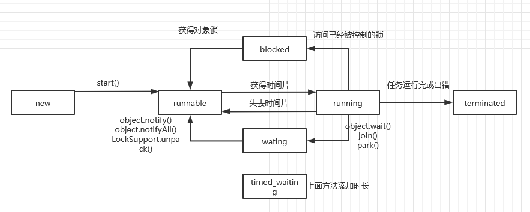
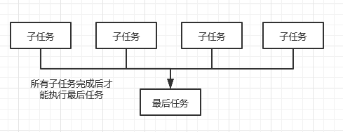
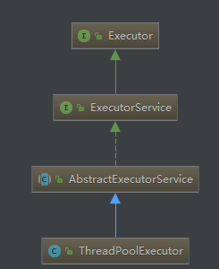
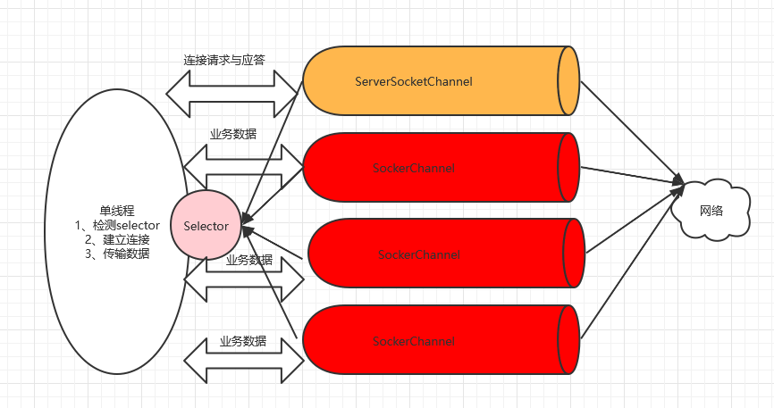
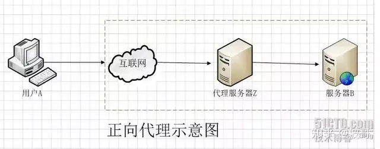

# JAVA

## 快捷键

| Alt + Insert     | 代码自动生成，如生成对象的 set / get 方法，构造函数，toString() 等 |
| ---------------- | ------------------------------------------------------------ |
| Alt + Enter      | 提供快速修复选择，光标放在的位置不同提示的结果也不同         |
| Ctrl + O         | 选择可重写的方法                                             |
| Shift + Enter    | 开始新一行。光标所在行下空出一行，光标定位到新行位置         |
| Ctrl + Alt + T   | 对选中的代码弹出环绕选项弹出层 （比如增加try-catch块）       |
| Ctrl + Shift + / | 代码块注释                                                   |
| Ctrl + Shift + U | 对选中的代码进行大 / 小写轮流转换 （必备）                   |


缩写

| psvm | public static void main(String[] args){} |
| ---- | ---------------------------------------- |
| sout | System.out.println()                     |
| souf | System.out.printf()                      |
| fori | for (int i = 0; i < ; i++) { }           |


## 基础

### Object

所有类的超类


#### equals和hashcode

equals默认是比较两个对象实例的引用，但我们平时更多的用到比较两个对象逻辑上是否相同

那么就需要重写equals方法，一般ide内置了重写这种方法

并且针对哈希表这种存储结构，两个对象在逻辑上相同，那么其hashcode以应该相同，不然的话存到hash表中的数据会因为hashcode不一样而再也找不到。

```java
 @Override
    public boolean equals(Object o) {
        if (this == o) return true;
        if (!(o instanceof Bread)) return false;
        Bread bread = (Bread) o;
        return Objects.equals(color, bread.color) &&
                Objects.equals(taste, bread.taste);
    }

@Override
    public int hashCode() {

        return Objects.hash(color, taste);
    }
```


#### compareTo和Compartor

compareTo是类继承了Comparble排序接口，相当于内部比较器

Compartor是比较器接口，相当于外部比较器


```java
    public static void main(String[] args) {
        Bread bread = new Bread(5,"read");
        Bread bread1 = new Bread(2,"read");
        Bread bread2 = new Bread(1,"read");
        List<Bread> list = new ArrayList<>();
        list.add(bread);
        list.add(bread1);
        list.add(bread2);
        System.out.println(list);
        Collections.sort(list);
        System.out.println(list);
    }
}
@ToString
class Bread implements Comparable{
    @Override
    public int compareTo(Object o) {
        Bread bread = (Bread)o;
        return this.price>bread.price?1:-1;
    }

    private int price;
```

```java
Comparator<Bread> objectComparator = new Comparator<Bread>(){
            @Override
            public int compare(Bread o1, Bread o2) {
                return o1.getPrice()>o2.getPrice()?1:-1;
            }
        };
        Collections.sort(list,objectComparator);
```


#### Collection和Colletions

Collection是集合类上层接口


Colletions是集合类帮助类，里面写好了很多帮助方法，类似于Executors类

### 代理

1. 静态代理（每对一个对象进行代理就需要写一个代理类）
2. 如果加入容器的目标对象有实现接口,用JDK代理
3. 如果目标对象没有实现接口,用Cglib代理


### 反射和注解

#### 注解

##### 元注解

元注解的作用就是注解其他注解的注解，java定义了4个元注解

包括@Target、@Rentention、@Documented、@Inherited

| @Target     | 描述注解的范围            |
| ----------- | ------------------------- |
| @Rentention | 表示注解生命周期          |
| @Documented | 该注解是否保存在javadoc中 |
| @Inherited  | 是否可以被继承            |


定义注解

```java
public class Test {

    @MyAnnoation
    public void test(){

    }
}

@Target(ElementType.METHOD)
@Retention(RetentionPolicy.RUNTIME)
@interface MyAnnoation{
    String name() default "";
}
```

注解实际是需要反射配合使用


#### 反射

有三种方法可以获得class对象

```
//根据类名
Person.class
//根据类实例
person.getClass()
//根据全类名
Class.forName("com.Person")
```


##### 类的加载

1. 加载：把class文件加载到内存中，并将静态数据转换成方法区中，生产Class对象
2. 链接：将java二进制代码合并到jvm中
   1. 验证：确保类信息符合规范
   2. 准备，为类变量分配内存，设置默认值，在方法区中分配
   3. 解析：将符号引用转换成直接引用
3. 初始化：
   1. 执行类初始化器<clinit>：**所有的类变量初始化语句和类型的静态初始化器**static前缀
   2. 当初始化一个类时候，如果父类没有初始化，先初始化父类


类何时初始化

1、主动引用：发生类初始化

主要有new对象和反射加载

2、被动引用：不发生初始化

子类调用父类类常量

创建类数组

访问常量

```java
public class Test {
    public static void main(String[] args) throws Exception{
        System.out.println(Person.a);
    }

}

class Person{

    static {
        System.out.println("被初始化");
    }
    private String name;
    private int age;

    static final int a =5;

}
```


创建对象

```java
 Class<Person> personClass = Person.class;
        //通过class创建对象
        Person person = personClass.newInstance();
        System.out.println(person);
        //通过构造函数创建对象
        Constructor<Person> declaredConstructor = personClass.getDeclaredConstructor(String.class, int.class);
        Person person1 = declaredConstructor.newInstance("留言", 5);
```


通过反射获取方法并调用

```java
		Person person = personClass.newInstance();
        Method setName = personClass.getMethod("setName", String.class);
        setName.invoke(person,"留言11");
        System.out.println(person);
```


通过反射获得注解信息

```
Class<Person> personClass = Person.class;
        //获得类上的注解
        MyAnnoation annotation = personClass.getAnnotation(MyAnnoation.class);
        System.out.println(annotation.value());
        //获得属性上的注解
        Field[] declaredFields = personClass.getDeclaredFields();
        for (Field field:declaredFields){
            MyFiled myFiled = field.getAnnotation(MyFiled.class);
            System.out.println("相加"+(myFiled.a()+myFiled.b()));
        }
        
        
        
        
 @MyAnnoation("liquid")
class Person{
    @MyFiled(a=3,b=3)
    private String name;
    @MyFiled(a=4,b=4)
    private int age;
    public Person(){

    }
    public Person(String name,int age){
        this.name = name;
        this.age = age;
    }

}


@Target(ElementType.TYPE)
@Retention(RetentionPolicy.RUNTIME)
@interface MyAnnoation{
    String value() default "";
}

@Target(ElementType.FIELD)
@Retention(RetentionPolicy.RUNTIME)
@interface MyFiled{
    int a();
    int b();
}
```


### 多线程

#### 进程和线程

| 进程 | 操作系统动态执行的基本单元，既是基本的分配单元，也是基本的执行单元 |
| ---- | ------------------------------------------------------------ |
| 线程 | 作为时间调度的基本单元，共享进程内的资源                     |


#### 线程实现

java中实现线程有两种方式

- 实现Runnable接口

  ```java
  public class ThreadRunn{
  
      public static void main(String[] args) {
          new Thread(new NewRunnable()).start();
      }
  }
  
  class NewRunnable implements Runnable{
      @Override
      public void run() {
          System.out.println("任务执行");
      }
  }
  ```

- 继承Thread重写run（）

  ```java
  public class NewThread extends Thread {
      public static void main(String[] args) {
          new NewThread().start();
      }
  
      @Override
      public void run() {
          System.out.println("继承Thread");
      }
  }
  ```

  *一般来说实现Runnable是更好的选择，可以提高程序的扩展性和灵活性。*

  

  Thread类用来管理线程，如设置线程优先级、设置Daemon属性，读取线程名字和ID

  Thread类默认实现了Runnable接口，并将其构造方法的重载形式允许传入Runnable接口对象作为任务

  Thread在调用start()会触发jvm底层创建新线程执行run（）

  ```
  public class Thread implements Runnable{
  	private Runnable target;
  	public void run() {
          if (target != null) {
              target.run();
          }
      }
  }
  ```


#### 线程状态

```java
public enum State {
	NEW,
	RUNNABLE,
	BLOCKED,
	WAITING,
	TIMED_WAITING,
	TERMINATED;
}
```

各状态区别：

1. Thread.sleep()不会释放对象的锁和CPU
2. Object.wait()释放锁和CPU
3. BLOCKED状态使当前线程阻塞，会占有CPU等待抢占锁
4. LockSupport.park(）没有使用锁，不占用CPU




#### 线程安全

为了解决多线程下资源的竞争问题，java提出了一些方法来解决

##### synchronized

基于java底层对每个对象设置了一个监视器锁，当一个线程获得该对象监视器锁后，其他线程无法获得，只有等待。synchronized是一个排他锁


从下面结果可以看到同步方法与非同步方法互相不影响，而同步方法之间会因为一个正在执行，另外一个无法执行

```java
public class ClockTest {
    public static void main(String[] args) {
        Clock clock = new Clock(10);
        new Thread(()->{
            clock.timeout();
        }).start();
        new Thread(()->{
            clock.timeUp();
        }).start();
        new Thread(()->{
            clock.tick();
        }).start();
    }
}
class Clock {

    private int start;

    public Clock(int start) {
        this.start = start;
    }

    public  void timeout(){
        synchronized (this){
            while (start>0){
                System.out.println(Thread.currentThread().getId()+"倒计时:"+start--);
            }
        }
    }

    public  void timeUp(){
        synchronized (this){
            while (start<10){
                System.out.println(Thread.currentThread().getId()+"正计时"+start++);
            }
        }
    }

    public void tick(){
        System.out.println("进入tick");
        while (true){
            System.out.println("ticking");
            try {
                TimeUnit.SECONDS.sleep(1);
            } catch (InterruptedException e) {
                e.printStackTrace();
            }
        }
    }

}


11倒计时:10
11倒计时:9
11倒计时:8
11倒计时:7
11倒计时:6
11倒计时:5
11倒计时:4
11倒计时:3
11倒计时:2
11倒计时:1
12正计时0
进入tick
ticking
12正计时1
12正计时2
12正计时3
12正计时4
12正计时5
12正计时6
12正计时7
12正计时8
12正计时9
ticking
ticking
ticking
```


##### jdk常见安全类型

###### vector和arraylist

Vector是线程安全的集合，底层是静态数组，所有方法都加了同步，在高并发下性能很低

ArrayList是jdk为了优化Vector，取消了所有同步方法，底层依然使用静态数组，但并发下会出错


###### StringBuffer和StringBuilder

StringBuffer中的方法都使用了同步方法

StringBuilder取消了同步机制


###### HashMap和ConcurrentHashMap

在jdk1.8中HashMap由数组和链表组成，当链表长度超过8时候，链表变成红黑树

HashMap没有同步机制，并发下不安全

ConcurrentHashMap使用同步代码块，用于增加线程安全性


#### 线程通信

使用Object的notify和wait方法

使用这两个方法前都需要获得object对象的监视器锁

```

```

```java
public class Example {
    public static void main(String[] args) {
        Object object = new Object();
        new Thread(()->{
            for (int i = 0; i < 5; i++) {
                System.out.println(Thread.currentThread().getId()+",i="+i);
                if(i==3){
                    synchronized (object){
                        try {
                            object.wait();
                        } catch (InterruptedException e) {
                            e.printStackTrace();
                        }
                    }
                }
            }
        }).start();
        new Thread(()->{
            try {
                TimeUnit.SECONDS.sleep(2);
            } catch (InterruptedException e) {
                e.printStackTrace();
            }
            synchronized (object){
                System.out.println("唤醒计数器");
                object.notify();
            }
        }).start();
    }
}
```


join()方法会让另外一个线程介入当前线程，只有线程执行完或者超时才会回到当前线程继续执行，并且join方法底层是调用了wait方法，所以线程是进入了waiting状态的


#### CountDownLatch计数器

java.util.concurrent的包下的类,构造函数输入一个数字后，等待数字对应的任务执行完毕，然后执行最后一个线程



包含了await方法	阻塞当前任务，只有count为0时候，才不会阻塞

​			countDown 每执行完一个任务就减少1

​			getCount

```java
public class CarAssembleExample {
    public static void main(String[] args) {
        CountDownLatch countDownLatch = new CountDownLatch(10);
        LastTask lastTask = new LastTask(countDownLatch);
        new Thread(lastTask).start();
        for (int i = 0; i < 10 ; i++) {
            WorkTask workTask = new WorkTask(countDownLatch,i);
            new Thread(workTask).start();
        }
    }
}
class WorkTask implements Runnable{
    private CountDownLatch countDownLatch;
    private int id;
    public WorkTask(CountDownLatch countDownLatch,int id) {
        this.countDownLatch = countDownLatch;
        this.id = id;
    }

    @Override
    public void run() {
        try {
            TimeUnit.SECONDS.sleep(1);
        } catch (Exception e) {
            e.printStackTrace();
        }
        countDownLatch.countDown();
        System.out.println("id"+id+"配件生产完成");

    }
}
class LastTask implements Runnable{
    private CountDownLatch countDownLatch;

    public LastTask(CountDownLatch countDownLatch) {
        this.countDownLatch = countDownLatch;
    }
    @Override
    public void run() {
        try {
            System.out.println("等待其他配件生产");
            countDownLatch.await();
        } catch (InterruptedException e) {
            e.printStackTrace();
        }
        System.out.println("最后组装完毕");
    }
}
```


#### CyclicBarrer

屏障，只有所有线程都调用了await()方法后才能允许下一步工作，用处上来说与CountDownLatch其实一样


#### Semaphore

信号灯，通过设置多个凭证，线程需要通过acquire获取凭证，否则无法执行操作，持续等待，当执行完后release释放凭证

```java
public class SemaphoreTest {
    public static void main(String[] args) {
        Semaphore semaphore = new Semaphore(3);
        for (int i = 0; i < 10; i++) {
            new Thread(new Student(semaphore)).start();
        }
    }
}
class Student implements Runnable{
    private Semaphore semaphore;

    public Student(Semaphore semaphore) {
        this.semaphore = semaphore;
    }

    @Override
    public void run() {
        try {
            semaphore.acquire();
        } catch (InterruptedException e) {
            e.printStackTrace();
        }
        System.out.println(Thread.currentThread().getId()+"实验完成");
        semaphore.release();
    }
}
```


#### 死锁

必要条件

|           循环等待           |          一直持有          |
| :--------------------------: | :------------------------: |
|           互斥条件           |     资源只能一个人持有     |
|        资源不能被抢占        | 他人不能抢占已经占有的资源 |
| 线程持有资源并等待另一个资源 |      鱼和熊掌都想兼得      |


#### 线程池

ThreadPoolExecutor类最常用的底层线程类

包括了核心线程、阻塞队列和普通线程

当核心线程能满足任务时候创建对等的核心线程

当不能满足时候，放到阻塞队列，等待核心线程

当阻塞队列装慢后，创建普通线程来执行任务，普通线程执行完任务后关闭




##### Executor

线程层顶层接口，只定义了一个执行任务的方法

```java
public interface Executor {
    void execute(Runnable command);
}
```


ExecutorSerivce

在Executor基础上提供了生命周期的方法，供子类实现

```java
public interface ExecutorService extends Executor {
	void shutdown();
    List<Runnable> shutdownNow();
    boolean isTerminated();
    <T> Future<T> submit(Callable<T> task);
    等....
}
```

其中submit方法也是执行任务，只是起会返回Future对象回来，而execute没有返回值

并且submit的入参时Callable，而execute是Runnable


Callable接口提供了call方法调用来从任务中返回值出来

```java
public interface Callable<V> {
    V call() throws Exception;
}
```


Executors

工具类，可以创建各种线程池、线程工厂

线程池如下

| newFixedThreadPool      | 固定线程数量                                                 |
| ----------------------- | ------------------------------------------------------------ |
| newSingleThreadExecutor | 只有一个线程在处理                                           |
| newCachedThreadPool     | 核心线程为0，创建Int整形范围内的工作线程                     |
| newScheduledThreadPool  | 设置延时线程，该类自定义了ScheduledExecutorSerivce，并且将Runnable包装为ScheduledFutureTask，它继承了FutureTask类并且实现了RunnableScheduledTask |
| newWorkStealingPool     | 基于多核CPU，底层使用forkjoin来处理，上层类为ForkJoinPool    |


线程工厂

接口很简单就提供了一个创建线程的方法待子类实现

```java
public interface ThreadFactory {
    Thread newThread(Runnable r);
}
```


并且线程池在创建线程时候其实也是调用了线程工厂来创建的，只是一般都选择默认的线程工厂创建，在其中通过addWork()中的创建Worker构造函数来从线程工厂获取线程对象的

```java
w = new Worker(firstTask);

Worker(Runnable firstTask) {
            setState(-1); // inhibit interrupts until runWorker
            this.firstTask = firstTask;
            this.thread = getThreadFactory().newThread(this);
   }
```


案例如下根据简单工厂创建线程

```java
public static void main(String[] args) {
        ThreadFactory threadFactory = Executors.defaultThreadFactory();
        threadFactory.newThread(()->{
            System.out.println("新线程"+Thread.currentThread().getId());
        });
        System.out.println("主线程"+Thread.currentThread().getId());
    }
```


#### 锁

##### ReetrantLock

可重入锁，用法上与synchronized差不多

```java
class Lock1{
    private final ReentrantLock reentrantLock = new ReentrantLock();

    public void m1(){
        reentrantLock.lock();
        try {
            m2();
        }finally {
            reentrantLock.unlock();
        }
    }
```


与synchroinzed的比较

- 都是互斥锁具有独占性和排斥性
- ReetrantLock是显示，依赖于jdk，而synchronize是隐式，其是java底层内置的锁，依赖于jvm
- ReetrantLock更加灵活拥有扩展性
- ReetrantLock可以与多个监视器配合，而synchronize只能与一个监视器配合


##### Conditon

监视器对象，用法上与Object的wait()和notify一样

对应condition里面的await()和signal()


##### ReentrantReadWriteLock

内部定义了两个锁读锁和写锁，可以用来对数据的并发读写

```java
public class ReentrantReadWriteLock
        implements ReadWriteLock, java.io.Serializable {
    private final ReentrantReadWriteLock.ReadLock readerLock;
    private final ReentrantReadWriteLock.WriteLock writerLock;
```


#### 阻塞队列

| ArrayBlockingQueue  | 底层是数组，需要显示传入长度，是有界                         |
| ------------------- | ------------------------------------------------------------ |
| LinkedBlockingQueue | 底层是链表，不需要传入长度，是无界                           |
| SynchrouonsQueue    | 底层是空集合，没有长度，只有在插入线程和提取线程同时存在时候，才会传输数据，否则一直阻塞 |
| DelayQueue          | 无界阻塞队列，只有在延迟等待时间到达后才会添加到队列中，否则队列没有元素。实现了Delay接口，改接口继承了Comparble方法提供了排序，并且提供了一个getDelay方法，告知延期还有多长 |

ArrayBlockingQueue和LinkedBlockingQueue，LinkedBlockingQueue的并发性更好因为，他的put和take方法是有两个不同的锁来管理的，相互不影响，而ArrayBlockingQueue是由一个锁来管理两个方法。

```java
LinkedBlockingQueue
/** Lock held by take, poll, etc */
    private final ReentrantLock takeLock = new ReentrantLock();

    /** Wait queue for waiting takes */
    private final Condition notEmpty = takeLock.newCondition();

    /** Lock held by put, offer, etc */
    private final ReentrantLock putLock = new ReentrantLock();

    /** Wait queue for waiting puts */
    private final Condition notFull = putLock.newCondition();
```

阻塞队列在读写数据时候，当前线程阻塞状态使WAITING，当条件满足时候会自动唤醒


#### AQS

AQS全称为AbstractQueuedSynchronizer，该框架提供了一套同步管理通用机制

AQS对外暴露了state的值来同步状态，通过对变量使用volatile和方法CAS（compare and set）来保证同步

CAS依赖于CPU底层，适用于多线程下解决变量同步问题

volatile作用是让jvm读取和改变变量时候直接从主存中拿，而不用的情况下是从本地内存拿，而不是直接在主存读写。

```java
private volatile int state;
protected final int getState() {
        return state;
    }
 protected final void setState(int newState) {
        state = newState;
    }
protected final boolean compareAndSetState(int expect, int update) {
        // See below for intrinsics setup to support this
        return unsafe.compareAndSwapInt(this, stateOffset, expect, update);
    }
```

对于并发修改变量，volatile不起作用

| volatile           | synchronize      |
| ------------------ | ---------------- |
|                    | 解决独占性       |
| 线程同步轻量级实现 | 相对重量         |
| 不会阻塞           | 阻塞线程         |
| 只能修饰变量       | 修饰方法和代码块 |


下面是用AQS实现的简单互斥锁

```java
public class Mutux {
    public static void main(String[] args) {
        MyMutux myMutux = new MyMutux();
        ExecutorService pool = Executors.newCachedThreadPool();
        for (int i = 0; i < 100; i++) {
            pool.execute(()->{
                myMutux.lock();

                System.out.println(Thread.currentThread().getId());
                System.out.println(Thread.currentThread().getId()+"锁住当前线程");

                myMutux.unlock();
            });
        }

    }
}
class MyMutux {
    private final Sync sync = new Sync();

    class Sync extends AbstractQueuedSynchronizer {
        {
            this.setState(0);
        }
        @Override
        protected boolean tryAcquire(int arg) {
            return compareAndSetState(0, 1);
        }

        @Override
        protected boolean tryRelease(int arg) {
            setState(0);
            return true;
        }


    }
    public void lock() {
        if (!sync.tryAcquire(0));
    }

    public void unlock() {
        sync.tryRelease(0);
    }
}
```


### 网络编程

#### BIO

bio是阻塞的I/O，可以用在并发量不高的网络中


socket通信是网络编程的基本模型，与同步和异步无关，与阻塞和非租塞也无关

分为三步：1、建立连接；2、进行会话；3、关闭连接

基本代码

服务器开启端口，客户端连接端口

```java
#服务器
ServerSocket serverSocket = new ServerSocket(port);
Socket socket = serverSocket.accept();

#客户端
InetSocketAddress inetSocketAddress = new InetSocketAddress(ipAddr,port);
Socket socket = new Socket();
socket.connect(inetSocketAddress,30000);
```


完整的socket通信框架应该有超时设置

- 连接超时

  连接设置了3秒连接，超过了就断开

  ```java
  socket.connect(inetSocketAddress,30000);
  ```

- 读超时

  ```
  socket.setSoTimeout(20000);
  ```

- 写超时

  一般写超时是基于TCP重传机制，不需要自己再设置

  

#### NIO

NIO称为非阻塞式I/O，又称为多路复用

NIO由单线程、Selector、SelectionKey、ServerSocketChannel和SocketChannel组成

服务器开启监听接口后，绑定一个ServerSocketChannel，此只有一个用来处理连接请求与应答，收到连接后，创建SocketChannel来处理数据，以上两个SocketChannel都会有个一个对应的SelectionKey来作为凭证，Selector通过SelectionKey来选择对应通道执行操作


NIO又称为多路复用，能在高并发环境下提高CPU效率，减少线程之间的切换

nio下的read和write是非租塞的，系统通过selector的select方法来轮询检查是否有事件就绪（注意这里是阻塞的，没有事件的话会等地），就绪后就可以处理




##### ByteBuffer

重要属性

| mark     | 记录了当前标记索引下标       |
| -------- | ---------------------------- |
| position | 当前读取或者写入的位置       |
| limit    | 当前读入或可以写入的最多下标 |
| capacity | 表示当前数组容量大小         |
| array    | 保存当前存入元素             |


是java在NIO中引入的类型，本质是对字符数组的封装

ByteBuffer.allocate()和ByteBuffer.wrap()对无效内容的字符数组创建的ByteBuffer是写模式，等待程序写入元素

对有效内容的时候是读模式，等待程序读取元素

ByteBuffer.flip()转换ByteBuffer为读模式

ByteBuffer.clear()转换为写模式

ByteBuffer.hasRemaining()可以知道是否还有写模式的空间或者读模式数据可用


## 项目过程

- 启动，可行性分析，立项，了解项目背景
- 计划阶段：进度安排，资源计划，成本估计，质量保证计划，风险考虑，实施细节
- 实施阶段：开发，测试，上线
- 收尾


## WEB

正向代理

客户端想要访问原始服务器，无法访问到或其他原因，通过代理服务器来帮助他来访问



反向代理

客户端访问的原始服务器就是代理服务器，代理服务器再根据需求转到其他服务器


### WEB发展

单体时代会面临一些高并发和高可用的问题，比如tomcat连接用光，数据库I/O频繁或者挂掉


使用负载均衡技术，采用对服务器复制策略，在一定程度上缓解高并发高可用问题，并且采用redis解决不同服务器session不一致问题


但每个tomcat都过于臃肿，用户如果在某一时间只对某种服务做出请求，会对服务器其他的服务造成影响

并且维护服务器成本巨大，更改一处代码，所有服务器都需要重新上传运行


对服务进行切分，每个具体服务分到某个tomcat中，采用nginx的反向代理和负载均衡，当访问某个服务时候，nginx会把请求根据轮询机制传到特定服务器上


AKF方法论


## Spring

分为IOC和AOP两个

### IOC

控制反转，就是把java对象生成交给了spring来管理


对象谁来创建？

spring容器

对象如何创建？

使用反射

```java
Class clazz =  Person.class;
Constructor ctor = clazz.getConstructor();
Object obj =  ctor.newInstance();
```


 


#### IOC容器设计与实现

有两个主要容器系列：一个是beanFactory接口的简单容器系列，只实现了容器最基本的功能；一个是ApplicationContext，他作为容器高级形态


在spring中，实际是把DefaultListableBeanFactory作为一个默认的完整IOC容器使用。

spring通过定义BeanDefintion来管理基于spring的各种对象及其依赖关系。BeanDefintion抽象了我们对Bean的定义


#### beanFactory比较

beanfactory和factoryBean，前一个是管理bean的，后一个适用于那些在配置文件中不好生成的bean（添加信息过多太繁琐的）提供了了一种自定义方式生成bean

```java
@Component
public class LiquidFactoryBean implements FactoryBean {
    public Object getObject() throws Exception {
        Liquid liquid = new Liquid();
        liquid.setId(123);
        liquid.setName("factory bean is good");
        return liquid;
    }

    public Class<?> getObjectType() {
        return null;
    }

    public boolean isSingleton() {
        return false;
    }
}
```


#### IOC容器初始化

IOC容器初始化是由前面介绍的refresh()方法来启动的。分为下面三步：

1、第一个过程时Resource的定位

2、是BeanDefintion的载入

3、向IOC容器注册这些BeanDefinition的过程


容器初始化完成以后，客户第一次请求容器获得bean，容器才会把bean相应的依赖关系进行注入，如果提前注入可以使用lazy-init属性进行设置，在依赖完成后，容器会维持这些依赖关系


##### BeanDefintion的载入和解析

下面是载入过程，这里创建了一个XmlBeanDefinitionReader来解析beanDefintion

```java
protected void loadBeanDefinitions(DefaultListableBeanFactory beanFactory) throws BeansException, IOException {
        XmlBeanDefinitionReader beanDefinitionReader = new XmlBeanDefinitionReader(beanFactory);
        beanDefinitionReader.setEnvironment(this.getEnvironment());
        beanDefinitionReader.setResourceLoader(this);
        beanDefinitionReader.setEntityResolver(new ResourceEntityResolver(this));
        this.initBeanDefinitionReader(beanDefinitionReader);
        this.loadBeanDefinitions(beanDefinitionReader);
    }
```

这里会创建BeanDefinitionDocumentReader来读取Document树，并解析它按照bean规则

```java
public int registerBeanDefinitions(Document doc, Resource resource) throws BeanDefinitionStoreException {
        BeanDefinitionDocumentReader documentReader = this.createBeanDefinitionDocumentReader();
        int countBefore = this.getRegistry().getBeanDefinitionCount();
        documentReader.registerBeanDefinitions(doc, this.createReaderContext(resource));
        return this.getRegistry().getBeanDefinitionCount() - countBefore;
    }
```


##### Bean的注册

IOC容器DefaultListableBeanFactory用一个concurrentHashMap来管理BeanDefintion

```java
private final Map<String, BeanDefinition> beanDefinitionMap = new ConcurrentHashMap(256);
```

下面这段代码完成了注册

```java
this.beanDefinitionMap.put(beanName, beanDefinition);
```


##### bean的生命周期


###### beanpostProcessor

后置处理器是一个监听器，他可以监听容器触发的事件，要使用后置处理器，就需要具体的去实现BeanPostProcessor，然后配置称为bean，他有两个方法需要实现一个是applyBeanPostProcessorsBeforeInitialization，另外一个是applyBeanPostProcessorsAfterInitialization

下面的代码是applyBeanPostProcessorsBeforeInitialization的回调，把相应的bean对应的后置处理器迭代来执行相应方法

```java
public Object applyBeanPostProcessorsBeforeInitialization(Object existingBean, String beanName) throws BeansException {
        Object result = existingBean;
        Iterator var4 = this.getBeanPostProcessors().iterator();

        do {
            if (!var4.hasNext()) {
                return result;
            }

            BeanPostProcessor beanProcessor = (BeanPostProcessor)var4.next();
            result = beanProcessor.postProcessBeforeInitialization(result, beanName);
        } while(result != null);

        return result;
```


###### beanAware

当bean需要容器的一些状态时候，可以通过实现相应Aware接口来完成

如BeanNameAware可以在bean中的到IOC容器中bean实例名称

​	ApplicationContextAware可以在bean中得到上下文服务


### AOP

诞生背景：开发过程中程序总是出现一些重复的代码，而且不太方便使用继承的方法把他们重用或管理起来。他们功能单一重复且需要在不同位置。AOP就诞生了使用aop后不仅可以将这些重复的代码抽取出来单独维护，需要使用时候统一调用。在springaop中最新的可以使用注解来植入代码

aop的原理在于[代理](#代理)技术


#### 基本概念

- Advice通知
  - 定义了在连接点做什么，为切面增强提供织入接口，提供了各种通知接口
- PointCut
  - 决定了通知应该在那个连接点（也可以是那些方法）的集合
- Advisor通知器
  - 对通知和切入点的结合


#### 代理对象

下面是主要的继承关系，ProxyConfig是一个数据基类，提供了配置属性的功能。AdvisedSupport封装了AOP对通知和通知器的相关操作。由ProxyFactoryBean来完成相关aop逻辑工作


下面是总的流程this.initializeAdvisorChain();是在初始化通知器链

```java
public Object getObject() throws BeansException {
        this.initializeAdvisorChain();
        if (this.isSingleton()) {
            return this.getSingletonInstance();
        } else {
            if (this.targetName == null) {
                this.logger.warn("Using non-singleton proxies with singleton targets is often undesirable. Enable prototype proxies by setting the 'targetName' property.");
            }

            return this.newPrototypeInstance();
        }
    }
```

然后再根据单例或者原型调用aop代理，具体的aop代理根据类有无接口来选择jdk或者cglib（JdkDynamicAopProxy和CglibProxyFactory）

具体代理对象生成是ProxyFactoryBean的基类AdvisedSupport实现中借助AopSupportFactory完成的

```java
public AopProxy createAopProxy(AdvisedSupport config) throws AopConfigException {
        if (!config.isOptimize() && !config.isProxyTargetClass() && !this.hasNoUserSuppliedProxyInterfaces(config)) {
            return new JdkDynamicAopProxy(config);
        } else {
            Class<?> targetClass = config.getTargetClass();
            if (targetClass == null) {
                throw new AopConfigException("TargetSource cannot determine target class: Either an interface or a target is required for proxy creation.");
            } else {
                return (AopProxy)(!targetClass.isInterface() && !Proxy.isProxyClass(targetClass) ? new ObjenesisCglibAopProxy(config) : new JdkDynamicAopProxy(config));
            }
        }
    }
```


### 循环依赖

1、什么是循环依赖

两个对象创建依赖于对方

2、spring如何解决它

3、为什么要使用三级缓存解决循环依赖问题？

三级缓存的三个名字：singletonObjects、earlySingletonObjects、singletonFactories


三级缓存读取顺序：从一级缓存读，读不到就读二级缓存，二级缓存没有，就三级缓存


## springboot


## 设计模式

### 工厂模式

避免创建者与具体的逻辑处理相互混合，区分开来后更加清晰也更加容易扩展

```java
public class ImplFactory {
    public Impl getImpl(Class clazz)throws InstantiationException,IllegalAccessException{
        if (clazz == null) {
            return null;
        }
        return (Impl) clazz.newInstance();
    }
}

public class CarImpl implements Impl {
    @Override
    public void sendMessage(int id, String name) {
        System.out.println("car输送信息id="+id+",name="+name);
    }
}

public class Truck implements Impl {
    @Override
    public void sendMessage(int id, String name) {
        System.out.println("truck输送信息id="+id+",name="+name);
    }
}
@Test
    public void getFac()throws Exception{
        ImplFactory implFactory = new ImplFactory();
        implFactory.getImpl(CarImpl.class).sendMessage(3,"52");
        implFactory.getImpl(Truck.class).sendMessage(4,"31");
    }
```


### 模板模式

核心设计思想是通过抽象类中定义抽象方法的执行顺序，并将抽象方法设定为只有子类可以实现

好处在于模板模式定义了统一的执行标准，对于后续实现者来说不用关心调用逻辑，让每一个子类只做子类需要完成的内容


```java
public abstract class Mall {
    String id;
    String name;

    public void buy(String id){
        login(id);
        shoppingCart();
        pay();
    }
    protected abstract boolean login(String id);

    protected abstract void shoppingCart();

    protected abstract void pay();
}
public class DangDangMall extends Mall{
    protected boolean login(String id) {
        System.out.println("当当会员登录成功，id为:"+id);
        return true;
    }

    protected void shoppingCart() {
        System.out.println("当当添加物品到购物车");
    }

    protected void pay() {
        System.out.println("完成当当支付");
    }
}

public class JDmall extends Mall {
    protected boolean login(String id) {
        System.out.println("京东会员登录成功，id为:"+id);
        return true;
    }

    protected void shoppingCart() {
        System.out.println("京东添加物品到购物车");
    }

    protected void pay() {
        System.out.println("完成京东支付");
    }
}
```

测试结果如下

```java
public class Test {
    public static void main(String args[]){
        Mall mall = new JDmall();
        mall.buy("520");

        mall = new DangDangMall();
        mall.buy("520");

    }
}
京东会员登录成功，id为:520
京东添加物品到购物车
完成京东支付
当当会员登录成功，id为:520
当当添加物品到购物车
完成当当支付
```


### 观察者模式

观察者模式是当一个行为发生时候，一个用户传递消息，另一个用户接受信息并做出处理，行为和接受者之间没有直接的耦合关联

拆分了核心流程和辅助流程的代码，当需要增强其他监听器时候不需要修改额外的代码

下面创建了不同的监听器

```java
public interface EventListener {
    public void doEvent(String message);
}
public class DotaEventListener implements EventListener {
    public void doEvent(String message) {
        System.out.println("您的dota好友{}上线了"+message);
    }
}
public class LolEventListener implements EventListener{
    public void doEvent(String message) {
        System.out.println("您的lol好友{}上线了"+message);
    }
}
```

messageManage是注册、取消和通知不同类型的监听器

gameservice把核心业务和辅助业务区分了开

```java
public class MessageManage {
    private Map<EventType,List<EventListener>> listenerMap = new HashMap<EventType,List<EventListener>>();

    public MessageManage(){
        listenerMap.put(EventType.DOTA,new ArrayList<EventListener>());
        listenerMap.put(EventType.LOL,new ArrayList<EventListener>());
    }

    public enum  EventType{
        DOTA,LOL
    }
    public void subsribe(EventType eventType,EventListener eventListener){
        List listenerList = listenerMap.get(eventType);
        listenerList.add(eventListener);
    }

    public void unsubsribe(EventType eventType,EventListener eventListener){
        List listenerList = listenerMap.get(eventType);
        listenerList.remove(eventListener);

    }

    public void notify(EventType eventType,String message){
        List<EventListener> listenerList = listenerMap.get(eventType);
        for(EventListener listener:listenerList){
            listener.doEvent(message);
        }

    }
}
public class GameService {
    private MessageManage messageManage;

    public GameService(){
        messageManage = new MessageManage();
        messageManage.subsribe(MessageManage.EventType.DOTA,new DotaEventListener());
        messageManage.subsribe(MessageManage.EventType.LOL,new LolEventListener());
    }

    public void doGame(){
        String message = "liquid";
        messageManage.notify(MessageManage.EventType.DOTA,message);
        messageManage.notify(MessageManage.EventType.LOL,message);
    }
}
```


```java
public void watch(){
        GameService gameService = new GameService();
        gameService.doGame();
    }
您的dota好友{}上线了liquid
您的lol好友{}上线了liquid
```


### 适配器模式

适配器模式把本来不匹配的接口通过适配做到了统一

常见如MQ消息中，一般在系统中会定义多个MQ，每个MQ都有不同的字段，做过不做一个统一的规范，那么每个MQ都需要一个专门处理他的函数，可以把MQ中相同的字段提取出来，通过代理类可以把不同名字相同意思的字段做映射

如下为MQ消息

```java
public class CreateAccount {
    private String number;
    private String address;
    private Date accountDate;
    private String desc;

}

public class PopOrderDeliverd {
    private String uid;
    private String orderId;
    private Date orderTime;
    private Date sku;
    private Date skuName;
    private BigDecimal decimal;
}
```

统一输出的MQ

```java
public class RebateInfo {
    private String userId;
    private String bizId;
    private Date bizTime;
    private String desc;
}
```

使用适配器来对不同MQ做统一输出

```java
public class MQAdapter {
    public static RebateInfo filter(String strJson,Map<String,String> map){
        return filter(JSONObject.parseObject(strJson,Map.class),map);
    }
    //map的key是映射目的的属性，value是被映射放
    public static RebateInfo filter(Map obj,Map<String,String> map){
        RebateInfo rebateInfo = new RebateInfo();
        for(String key : map.keySet()){
            //获得被映射方的值
             Object val = obj.get(map.get(key));
             RebateInfo.class.getMethod("set"+key.substring(0,1).toUpperCase()
                     +key.substring(1),String.class).invoke(rebateInfo,val.toString());
        }
        return rebateInfo;
    }
}

```

之后对其测试

```java
@Test
    public void adapter()throws NoSuchMethodException,InvocationTargetException,IllegalAccessException{
        CreateAccount createAccount = new CreateAccount();
        createAccount.setAddress("北京朝阳");
        createAccount.setDesc("liquid love mavis");
        createAccount.setAccountDate(new Date());
        createAccount.setNumber("520");

        Map<String,String> map = new HashMap<String, String>();
        map.put("userId","number");
        map.put("bizId","address");
       // map.put("bizTime","accountDate");
        map.put("desc","desc");
        RebateInfo rebateInfo = MQAdapter.filter(JSONObject.toJSONString(createAccount),map);

        System.out.println(JSON.toJSONString(createAccount));
        System.out.println(JSON.toJSONString(rebateInfo));
    }

输出入下
{"accountDate":1635858351763,"address":"北京朝阳","desc":"liquid love mavis","number":"520"}
{"bizId":"北京朝阳","desc":"liquid love mavis","userId":"520"}
```

 


### 迭代器

java实现迭代器需要实现Collection集合接口，该接口提供了集合能提供的添加删除元素操作，并且Colletion接口继承自Iterable接口

```java
public interface Collection<E> extends Iterable<E> 
```

该接口提供了能够获得Iterator的方法


获得的Iterator类中包含了hasNext和next的方法

java所以实现Collection的类都必须可以返回一个迭代器遍历数据

```java
public interface Iterator<E> {	
	boolean hasNext();
	E next();
}
```

所以想要实现迭代器，就需要实现Collection接口，并且在实现返回迭代器方法的地方可以用匿名类来生成迭代器类

```java
class EmployeIterator implements Collection<Employee>{
    private int index = 0;
    private List<Employee> list;
    public EmployeIterator(){
        list = new ArrayList<>();
    }
    @Override
    public Iterator<Employee> iterator() {
        return new Iterator<Employee>() {
            @Override
            public boolean hasNext() {
                return index<list.size();
            }

            @Override
            public Employee next() {
                return list.get(index++);
            }
        };
    }
    @Override
    public boolean add(Employee employee) {
        return list.add(employee);
    }

    @Override
    public boolean remove(Object o) {
        return list.remove(o);
    }
}
```


迭代器优点在于能够以相同方式遍历不同的数据结构元素，用户在遍历时候不需要关心内部实现逻辑，做到统一便用，但是在实现上相对要复杂一点。