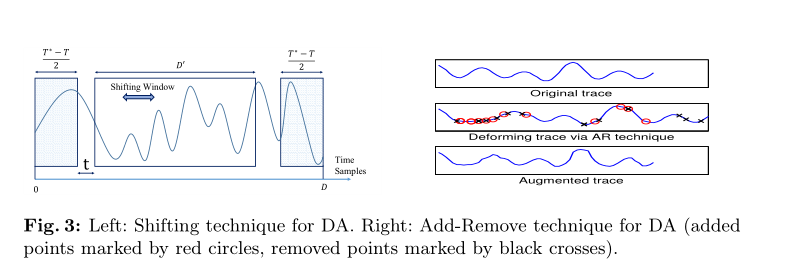
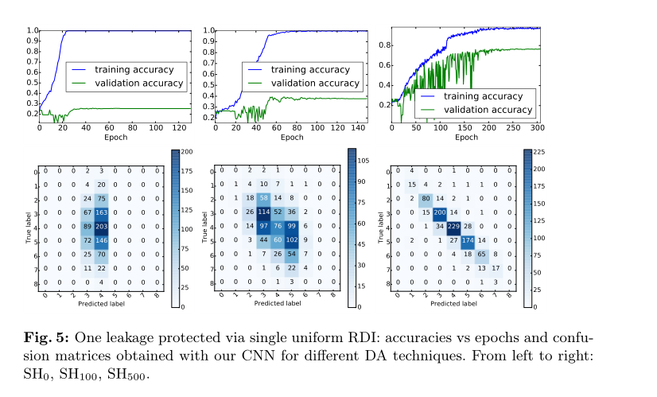
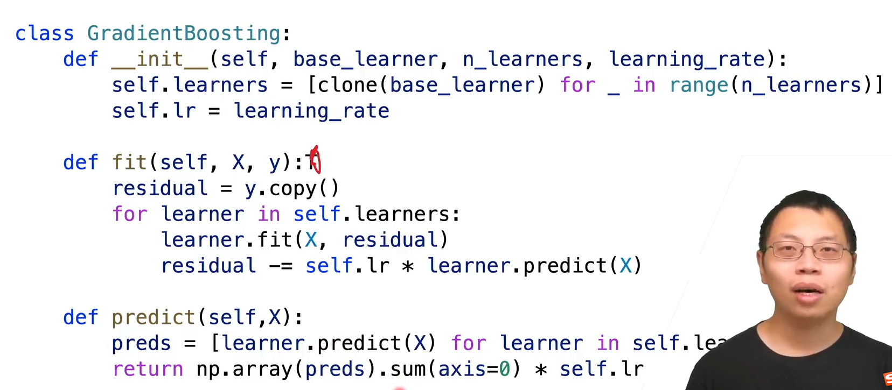

# 功耗分析攻击

历史：

​		pioneering work of Kocheret al.[KJJ99], simple power analysis (SPA)
and differential power analysis (DPA) attacks have been introduced

​		A particularly interesting class of poweranalysis attacks, so-called template
attacks, has been introduced by Chariet al.[CRR03]

分为两个阶段：

1. 功耗曲线采集：攻击者使密码芯片执行多次独立操作，并对功耗泄露信息进行采集并保存曲线
2. 分析攻击：主要利用统计学方法对功耗泄漏信息进行分析，从中获得密钥相关信息


## Shamir's Secret Sharing 

什么是安全共享：

​	安全共享就是把私有信息分成小块存储到不同地方，每个小块都不能得到完整的信息

​	但问题在于丢失一个小块都会让密码不能复现，而丢失或被偷窃是很经常的事情

***Shamir's Secret Sharing (SSS)*** is used to secure a secret in a  distributed way, most often to secure other encryption keys. The secret  is split into multiple parts, called **shares**. These shares are used to reconstruct the original secret.   

 To unlock the secret via Shamir's secret sharing, a minimum number of shares are needed. This is called the **threshold**, and is used to denote the minimum number of shares needed to unlock the secret. Let us walk through an example:

> Problem:  Company XYZ needs to secure their vault's passcode. They could use  something standard, such as AES, but what if the holder of the key is  unavailable or dies? What if the key is compromised via a malicious  hacker or the holder of the key turns rogue, and uses their power over  the vault to their benefit?

This is where SSS comes  in. It can be used to encrypt the vault's passcode and generate a  certain number of shares, where a certain number of shares can be  allocated to each executive within Company XYZ. Now, only if they pool  their shares can they unlock the vault. The threshold can be  appropriately set for the number of executives, so the vault is always  able to be accessed by the authorized individuals. Should a share or two  fall into the wrong hands, they couldn't open the passcode unless the  other executives cooperated. 

这个密码安全在于把密钥信息分到不同地方存储，并且允许通过小块来恢复整体信息，但要设置一定的阈值来限制


## 预处理

### 	对齐

​		机器学习训练和预测过程本质上是在学习数据的内在模式然后进行模式匹配，若功耗曲线在不同时间点上交错混淆，则会降低机器学习的性能。因此，在实施分析攻击前需要进行对功耗曲线执行对齐 (Align) 操作，以降低功耗曲线失调对攻击效果的影响


​		对齐分为基于模式匹配和基于频域的方法

```
	基于模式匹配是选择一条曲线的一部分作为模式保存下来，其他曲线寻找该模式，根据模式平移功耗曲线，使得已选模式在所有曲线的同一位置。
```

​		缺点：耗时过长，可能没有合适的模式，主要依靠模式的选择

		基于频域分析方法的基本思路是虽然时域上的功耗曲线对于相同操作的时间点无法对齐，但功耗信号满足能量守恒定律，因此可以将采集的包含密钥的时域信息转换到频域中


# 模板攻击

## 	其他攻击

DPA攻击的目标是记录密码设备对大量不同数据分组进行加密或解密操作时的能量迹，并基于能量迹恢复出密码设备中的密钥

SPA攻击主要沿时间轴来分析设备的能量消耗，攻击者试图在单条能量迹中找到某种模式或与模板进行匹配

DPA分析固定时刻的能量消耗与被处理数据之间的依赖关系（需要大量数据）

二阶DPA攻击利用了同一个掩码相关的两个中间值联合信息泄漏。


•n阶成功率：m次攻击中，正确子密钥排在前n名的比例；

•猜测熵：m次攻击中，正确子密钥的平均排名。


## 	传统

模板攻击是有学习的，并且需要有一个与加密设备完全相同的拷贝设备。

传统模板攻击使用多元高斯分布来表征泄露信息。

```
模板攻击分为一下三个步骤：**兴趣点提取、模板的构建、模板匹配**

兴趣点提取：分为SOD(成对差异之和)、SOSD(成对差异之和)、SOST(成对差异之和)、SNR(信噪比)、Perason系数法和PCA
	SOD是对某一时间段两两曲线做差，并把相同时刻的差值累加在一起，之后选出差值累计曲线突出最多的几个点
	SOSD是在SOD上的优化，在差值上做了平方，防止出现负值导致结果为0
	SOST是在前两个基础上优化，基于T-检验
	Pearson相关系数法对比某一个时刻的对应点和对应中间值，选择系数最大的
	PCA通过各种映射特征向量等
	

​		在传统模板攻击中，计算模板使用的是多元函数高斯分布，不可能使用全部能迹点，从效率上来说，计算纬度非常大的斜方差矩阵效率低，内存占用大，此外，容易产生奇异矩阵，这对协方差矩阵求逆是病态的。

模板构建：1、据和密钥对构建模板即针对每个数据和密钥对(di，kj)构建一个模板，但这个方法建立模板过多。

​					2、根据中间值建立模板，比如汉明，模板数量会比第一种少

模板匹配：攻击者利用特征模板和真实过程的能耗曲线来确定中间值


```


下面表达式就是模板匹配环节的表达式，其中m为均值向量，C为协方差矩阵

**根据极大似然估计，概率越大，反映的模板与能量迹越匹配，那么模板所对应的密钥就越接近真实密钥**


通常在实际中会使用多条真实能迹，我们会把每个真实能迹依次与单个模板匹配，如果某条能迹概率低，那么他们相乘后总的概率就会被迅速拉低。能帮助我们辨别出不适合的


## 	新型

​		前面讲的是传统模板攻击，当前传统模板攻击是基于高斯多元函数分布这一概率密度函数，多数情况下，符合泄漏，但理论上还有更好的刻画数据的模型。

​		**针对上面问题有两种方式，一种是通过简化计算公式，对容易造成问题的地方修改或去除（协方差矩阵求逆病态问题），但这种会导致模型攻击效果降低；另一种是采用机器学习代替高斯分布来进行学习，一方面避免了传统模板攻击在处理高纬度数据的不足，另一方面机器学习模型具有很强的特征捕捉能力。**

​		最新的模板攻击是基于机器学习和卷积神经网络的，也就是在模板构建环节把传统的多元高斯分布改为神经网络来训练。

 

侧信道与卷积神经网络的经验性原则：

1、能迹信噪比越低，卷积输出特征越小

2、能迹泄漏信息越少，首层卷积需要更大的卷积核

3、对能迹建模时候，不宜采用过深的卷积网络

4、对抖动严重的能迹，卷积网络中应选择最大池化


杨欢提出贝叶斯优化来帮助神经网络在侧信道攻击中寻得最优超参数


*周奕：使用传统的多元高斯分布和基于resnet的卷积神经网络模型建立模板，最终实验结果restnet比传统高了10%*

### 		高阶2阶DPA攻击

基于上述理论，一种较为简易的 2 阶 DPA 攻击的算法如图 2-4 所示： 
(1)假设两个中间值1v ，2v 的泄漏样本位置1P ，2P 之间的间距为 w。选择一个1p 的起始位置0A ，即可计算出 Person 相关系数1 2 1 2p(comb(v, v), pre(P, P)) 。其中，comb(v, v) 是两个中间值的组合值，12pre(P, P) 是两个样本位置上能量消耗的组合值。 
(2)不断向右移动1p 的位置 A，记录相关系数  的最大值。 
(3)并将 w 减小，返回步骤 1 重复执行上述步骤。 
(4)所有遍历结束后，挑选其中最大的相关系数  作为最终结果。该值即为
本次密钥猜测值 k 中相关系数  的最大值 ( )kk 。 
(5)针对可能的所有密钥猜测值进行上述操作，并将所有的k 值进行排序，
取k 最大值所对应的密钥猜测值，作为本次 2 阶 DPA 攻击的最终结果。即密钥 k
的选择公式为： argmax[ ( )]kk k 。 


### 		掩码模板攻击

#### 		掩码

掩码策略本质是尽可能去除密码设备能力消耗中数据以及操作依赖性。（好处：不改变设备的情况下，消除功耗对数据依赖性）

掩码又分为**固定掩码和随机掩码**

​		**固定值掩码**：固定值掩码使用的随机数掩码是事先计算得出的，不需要在运
算过程中再次计算。即，首先计算出 q 个掩码值，在算法执行前随机挑选其中的
1 个，将其加入加密过程中与中间值进行加掩操作。跟随机值掩码比较，该掩码

​		**随机掩码**：在每一轮加密运算时都产生一组随机数掩码，然后分别把它们与
明文进行异或运算，再将加掩后的结果进行“轮密钥加”运算


使用SVM和神经网络建立攻击掩码的模板以及攻击带掩中间值的模板，采用先攻击得到掩码，去掩后攻击带掩中间值的方式获取密钥。（并且所有对加掩设备的模板攻击均需要攻击者在训练阶段了解使用的掩码，这样训练阶段必须包含对掩码的输入或输出，这与真实加密设备是不同的）


​		王老师的文章提出：攻击者使用一个仅知道密钥的加掩设备，不需要了解掩码，直接学习关于无掩中间组合值的模板，从而可以采用模板攻击获得，这种方法叫**盲掩码模板攻击**

​		实验贡献了：

- 对加掩加密算法的盲掩码模板攻击方法，证实了可行性
- 采用神经网络，在信噪比极低（**信噪比低则有用信息越少）**的数据中，必须采用全批
- 容易过拟合，采用部分PCA加L2正则化能有效防止过拟合


高阶攻击是利用两个中间值联合泄漏信息


**攻击流程**


**特征选择**

该步骤是重要步骤，准确选择信息程度高的样本位置，对模板攻击能否成功以及成功率的高低有决定性的作用

上面文章因为是在未知掩码的情况下实施模板攻击，意味着训练阶段并不知道掩码，无法计算目标值，因此**采用二阶DPA攻击中相关系数较高的位置**

#### 盲掩码

```
创新：

​			1、在特征选取上抛弃了过去单纯的PCA降纬，而使用了分段PCA，基于Pearson相关系数，把能耗特征分为高泄漏和低泄漏，分别用不同幅度的PCA降纬，高泄漏部分降维幅度小，低泄漏部分降维幅度大。

​			2、使用L2正则化来解决过拟合问题，而不是增加数据量和dropout，那是因为过拟合的主要原因在于输入数据过多的噪声造成的。


```


#### **Timing Attacks on Implement at ions of**  **Diffie-Hellman, RSA, DSS, and Other Systems**

Kocher


#### **Differential Power Analysis     ‘--Kocher**

```
第一篇侧信道文章，提出了SPA，采集的能耗曲线能与实际密码操作对应
但SPA容易被掩码等技术给屏蔽

又提出了DPA，通过选择函数对特征点（一般曲线要15条左右才能破解）分别进行划分为两组，一般选择函数可以依据汉明权重来划分，大的汉明权重对应更大的能力消耗，然后求差分，之后看差分曲线是否有凸点，有代表密钥是正确的

```


#### **Templates as Master keys**

```
认为传统模板攻击需要对一个密钥字节建立256个模板，并且需要对所有的字节分别建立对应的模板，这造成了极大的冗余和浪费
```


```
提出了单字节模板攻击，基于DPA攻击去发现泄漏点，对每个bit基于前面泄漏明显的点建立一对模板（0,1），并且利用结果来指导进行暴力搜索

下图为DPA增强泄漏点
```


```
提出了加强模板的DPA攻击来攻击带掩码的
第一步用dpa来攻击1获得兴趣点和预测的bit，并且泄漏掩码bit信息
第二步对每个dpa攻击简历哦一对模板

说实话没读懂
```


#### **周冠豪论文**

```
证明了使用兴趣区间的多点作为神经网络输入的方式，攻击性能要高于使用明确兴趣点作为的输入，其正确密钥得到的对应相关系数与错误相比差距很大，其成功率也提高了


创新点：结合了高阶DPA和高阶模板攻击优势，提出新的攻击方式，基于神经网络的高阶CPA

可以采用更加复杂的模型来对攻击进行提高
```


#### **Another look on Second-order dpa**

```
对带掩中间值和掩码经过sbox进行结合，并记录两个位置的能耗
```


```
对能耗进行结合：
Chari提出下面式子，其中L为整条能迹曲线
```


Messegers提出


本文提出：


#### 

**Template Attacks on Masking—Resistance**
**Is Futile?论文：**

```
提出了基于DPA的模板攻击
本文解决在模板领域，无掩和有掩的情况下，安全是否有区别
本文得出没有区别，他们都有同样的效果，可以通过15次能力追踪召回密钥


```


#### **Practical Seconde-Order DPA Attacks for Masked Smart Card Implementations of Block Ciphers --Oswald**

```

```


#### **有学习的高阶 DPA 攻击**   **--吴震**	

```
神经网络在高阶DPA中体现出较为明显的优势，因为其具有较强的非线性映射的能力，能够自动发现输入能耗数据与目标值最佳的非线性映射方式

提出了兴趣区间和兴趣点提取上的对比，发现采用两者区别并不大，所以采用兴趣区间效果还要更好一点，所以基于机器学习的DPA攻击采用兴趣区间更好。因为能迹是连续的，仅通过两个点的提取会损失大量泄露信息的丢失，而使用到兴趣区域的提取方式能够更好地保留这些泄漏区域。

缺点：但是文章中兴趣点提出采用的PCA降维，并没有对保留多少贡献度做出合适对比，文章直接采用了贡献度为0.8。而且PCA自身在应用于侧信道中还是会损失不少信息的，有个别文章提到用分段PCA
	 并且在对神经网络采用不同隐藏层中作者说层数少的过拟合过强，但从作者发出的对比图片里面，两组过拟合其实都挺明显，文章作者的结论有点过于武断
```

下图为攻击流程

中间组合值为
$$
y=HW((x\bigoplus k')\bigoplus(sbox(x\bigoplus k')))
$$


#### **针对掩码AES的选择明文和二阶DPA组合攻击**

```
1999年，Kocher提出了差分能量分析。
2000年，Messagers提出了二阶DPA
2003年，Akkar提出新二阶DPA，即重叠攻击直接关联第一轮和最后一轮
2006年，Oswald等人对二阶DPA攻击方法进行改进
```


```
因为aes特性，通过选择明文，固定后面三个字节明文只改变第一个字节，所以密文字节的变化完全取决于第一个字节的变化，模型上采用汉明距离模型，需要记录密文前一个状态，下图即为区分函数。然后记录密文输出和功耗曲线
```


#### **神经网络结构在功耗分析中的性能对比  --刘飚**

```
循环掩码S盒，包含16位掩码，每次运行前，明文与随机掩码m异或，随后进入原始S盒，同时计算下轮掩码m+1代替之前掩码。
文章还对8个sbox的输出，用NN和RNN和LSTM做了对比，发现RNN和LSTM要优于NN的，这还是因为能迹具有时序性，两点之间具有相关性
得出tanh一般在层数深的情况下要优于relu
```


#### **基于改进残差网络和数据增强技术的能力分析攻击研究 --王 恺**

```
本文采用resnet，卷积核为一维，输出256，使用了高斯噪声和随机相位抖动来对AES的最后8bit进行攻击，实验结果与ASCAD的CNN_best和MLP_best进行了对比
```


#### **Using Second-Order Power Analysis to Attack DPA  Resistant Software**

```
提出了二阶攻击原理和实例
```


#### **Kernel Discriminant Analysis for Information Extraction in the Presence of Masking**

```
本文主要在于对兴趣点选择提供新方法：核判别分析
该方法不会使耗费时间成指数增长

```


#### **A machine learning approach against a masked AES**

```
实验证明了SVM在没有调参数情况下也要好于模板攻击，并且在特征数过多时候，模板攻击效果会降低，这是由于兴趣点过多造成的矩阵病态问题
```


#### **A Generic Protection against High-Order Differential Power Analysis --Akkar**

```
提出了新的DPA二阶攻击，叠加攻击，泄漏点采用des第一轮和最后一轮。
需要对第一轮输出和最有一轮输出的结果都做出比较是否有尖峰（选取一个sbox盒6bit，两个为12bit），所以可能性有4096
```


#### **NICV: Normalized Inter-Class V ariance for Detection of Side-Channel Leakage**

```
NICV：归一化级间方差。不需要另外一个克隆的设备，也不需要知道加密设备的密钥就可以得到泄漏点
他使用公共的明文或密文来检测泄漏点
NICV作为泄漏模型评估器，文章说NICV不是区分器，但能与CPA这些区分器合作提高他们的表现
```


**Breaking Cryptographic Implementations Using Deep Learning Techniques**

**--Houssem Maghrebi, Thibault Portigliatti?, Emmanuel Prouff**

```
比较了神经网络与传统模板攻击在三个不同数据库的比较，表明了神经网络在攻击未保护或者保护的AES实现方面上具有压倒性优势
本文数据集采用的DPA V2
```


#### **Template Attacks --Chari**

```
创新之作，提出了模板攻击，并不对样本噪声进行处理，而是对噪声进行建模
认为模板攻击是侧信道领域最强的攻击，并且只需要少量被攻击者能迹就能成功获得密钥
```


#### **智能卡模板攻击实验方法与技术研究  --包斯刚**

```
当前防御功耗分析攻击有三种：
1、隐藏类措施，通过加入噪声、密码操作中加入无关操作，这种操作原理上归于降低信噪比、影响功耗曲线对齐的手段
2、算法级别,典型的采用掩码
3、电路及措施，对CMOS电路进行改造，使得不管什么操作都产生相同的功耗


```


#### 基于深度神经网络的FPGA密码芯片电磁攻击研究 --罗漫

```
当前存在问题：1、为了 获取每一个中间值的电磁泄漏，需要人为将该中间值数据写入寄存器，然后采集，这种操作需要修改算法，适用性不高。2、基于汉明重量模型进行攻击，必须知道明文或密文，才能结合中间值的汉明重量计算出密钥，但在实际公鸡中，很难获得明文或密文

缺点：该文章只拿准确率来验证模型，但侧信道领域至少应该含有GE，众多研究表明机器学习指标不可靠在侧信道中

```


**A-Identtity**

```
本文在RESnet的残差块基础上提出了A-Identtity，针对不同的数据纬度变化
针对特征图变化采用池化进行下采样
针对通道数变化，采用数据重叠的方式
```


**卷积直连残差块**

```
在A-IDENTITY基础上提出了两个卷积直连残差块，其中两个区别在于，第一个是与输入连接，不需要对其进行BN，因为已经做了归一化了，并且没有添加RELU函数
```


**直连残差块**

```
对于输入输出相同的，用identity直接相连
```


**CIRESNET结构**


**CIResnet-LSTM-FC**

```
该模型既有局部特征又有时序特征
```


#### **应用于侧信道攻击的深度学习模型评估指标研究 --张佳佳**

```
贡献：1、提出了应用于侧信道攻击的新指标--交叉熵比率（CER），该指标内置于深度学习框架包中，且不需要实际攻击所以不需要大量轨迹。2、利用提出的新指标CER不受数据不平衡影响得情况下，提出了适用于侧信道攻击的深度学习损失函数，新的损失函数较交叉熵损失函数更优越
```

深度学习指标与侧信道指标评估冲突原因在于：1、机器学习指标如准确率Acc认为每条轨迹是独立的，实际上攻击集合中的轨迹来源于同一密钥；2、基于机器学习的建模攻击不是仅考虑每条轨迹预测概率中的最大值，而是其中所有的概率均会参与到攻击的计算过程中


目前对数据不平很问题有两种方案：1、使用权重来使代价函数趋于平衡；2、基于重采样技术，如SMOTE

但上诉方法是基于经验，没有明确理论表示他们能解决侧信道中数据不平衡问题，且数据重采样不适合掩码防护的情形


目前侧信道指标中所使用的的GE和SR，其中GE代表一次侧信道攻击中，正确密钥的最大似然得分排名的期望。SR代表一次侧信道攻击中，成功恢复密钥的概率。在基于深度学习的领域中，GE/SR有两个缺点：1、他们的计算是建立在大样本的情况下，如果样本不够，将使得模型性能下降。2、只有攻击时才能计算指标，代价过于大


文章提出了下面新的指标


针对数据不平衡问题，以汉明重量建模的各标签比例如下：


针对不平衡问题，提出新的损失函数


#### **针 对ＡＥＳ１２８算 法 的 密 钥 优 势 模 板 攻 击**

```
本文根据模板攻击建模需要上万条能迹，密钥恢复需要100条能迹的问题上，采用汉明权重建模并且开创性的提出了密钥优势叠加，使用约10条能迹恢复密钥
密钥优势模板攻击：
	1、选取特征点：采用差分和技术（SOD）和T检验技术
最后对同一模板下概率进行叠加，概率最大的模板为正确模板
```


#### **基于机器学习的密码芯片的电磁攻击技术研究**

```
本文提供一种对每一位密钥比特构建一个对应的泄露信息特征的模板，该方法理论上只需要一条曲线就能攻击成功
如des密钥56位，对每一个位建立一对模板，那么只需要建立56对模板
有两点好处：1、大大降低计算难度和存储空间；2、防止无关的抽样值扰乱降低准确度
并且提出了在未知明文的情况下，实施单比特模板攻击，选择了在置换选择1中进行，因为这里是不涉及明文操作的
```

下图是没有排除明文的情况


对于排除明文的情况要好于上图的


```
所有一下以下都是基于电磁泄漏
本文还提出了快速的模板攻击方法，利用公共协方差矩阵代替协方差，保证分类正确率同时，大大降低了计算复杂度数值问题，还放松了矩阵需要可逆的限制条件

omar等人指出样本曲线数量必须大于抽样点数量的时候，才能保证普通协方差矩阵不是病态的

利用攻击者不关心膜版匹配概率值本身，只需要知道排序即可破解密钥，对概率公式进行简化和变化，进一步使用公共协方差矩阵替代协方差矩阵。当训练样本曲线过少的时候可以采用单位矩阵来代替
```

#### **Neural Network Based Attack on a Masked Implementation of AES --Richard Gilmore**

```
RSM（循环sbox掩码）
```


```
本文用了两个神经网络模型，一个用于对掩码建模，一个用于恢复密钥
在特征选择上：使用CPA选择相关性排名靠前的特征点
在预处理上：采用[-1,1]的处理或Z-SCORE或PCA处理输入（不理解PCA如何处理）
```


#### 

**Study of Deep Learning Techniques for Side-Channel Analysis and Introduction to ASCAD Database**

```
创建了公共的数据集ASCAD
```

下面是数据库结构图


```
作者在文章中用MLP和SNN（SELF-NORMALIZING Neural Network）进行训练，SNN在未调参数情况下与MLP-best一样效果，并且采用的泄漏模型是直接对输出进行建模，而未使用汉明权重，作者认为汉明权重建模有些许问题（我也看不懂他说的问题）
```


```
作者还遵循了一下规则来建立适应SCA的vgg16
1、同一块中的卷积层采用相同的卷积核等配置
2、每个池的维度为2
3、每层block中filter数量，第i层为max(第一层block的filter数量*2^(i-1),512)
4、所有block卷积核大小相同
```

下面是作者自己的出的总结


#### **Practical Template attacks**

```
这些点之间的最小距离应该大约是一个时钟周期或更多，因为在同一个时钟周期中的额外点不会提供额外的信息。
所选点的最小高度应该高于差异和轨迹的噪声底。
```


#### **基于VGGNet卷积神经网络的加密芯片模板攻击新方法**

```
基于VGG较模板攻击提高7.7%
通过多项式特征增加特征属性，解决模型欠拟合问题
并且文章对VGG网络进行了改进，把卷积核大小从3*3改为了2*1，进一步提高了模型特征敏感度，下采样层从二维处理变为了一维。
```


#### **基于机器学习的功耗分析攻击研究**

```
功耗分析攻击需要选择 HW 和 HD 功耗泄漏模型计算假设中间值，然后确定功耗曲线对应的假设中间值类别，但 HW 和 HD 模型标注功耗曲线引入了类别不平衡问题。为了解决功耗分析攻击中的类别不平衡问题，我们使用包括 SMOTE 在内的数据重采样技术来改善类别不平衡场景下 ML-based PA 的攻击性能。同时，为了改善 SMOTE方法在合成新样本时存在的样本在特征空间分布不均匀、没有考虑类的边界等问题对ML-based PA 对攻击性能的影响，我们通过加入对近邻区域密集程度的考虑，首次提出了 Tri-SMOTE 过采样方法。然后，在此基础上使用数据清理方法 (ENN、Tomek links 等)来避免合成的少数类样本在特征空间出现过拟合
```

```
改善类别不平衡问题：
1、算法层面：修改分类器以减少对多数类的倾向
2、数据层面：通过数据重采样平衡数据的分布

本文重点介绍了数据重采样方法
技术分为欠采样和过采样
	在欠采样中，多数类的样本数量减少到与少数类数量相接近
	在过采样中，少数类的样本数量增加到与多数类的样本数量相等或相近
--随机欠采样--：对除最少数类的类进行欠采样。缺点是这样曲线过少，可能会删除重要信息
--又放回的随机过采样--： 通过对少数类有放回的重复随机采样生成样本，进而进行过采样。缺点可能会过拟合
--SMOTE--：合成少数类过采样技术（Synthetic Minority Oversampling Technique）通过取少数类样本及其k个少数类的最近领随机才样，引入合成样本

```


```
本文提出了新的方法Tri-SMOTE
解决了密集区域过于密集，稀疏区域过于稀疏问题，和SMOTE对类边界的影响，合成的新样本可能落在不同类别的重叠问题


上面生成样本可能会导致噪声样本落入不同分类中，这种会导致过拟合，一般需要使用数据清理方法删除冗余
Tomek links和ENN
Tomek links根据欧氏距离
ENN根据三个紧邻样本如果超过两个样本类别不同则剔除
```


#### **The Best of Two Worlds: Deep Learning-assisted Template Attack**

```
该文章没有采用深度学习代替模板攻击的模型建立，而是把它用到了特征选择阶段，实验效果证明其要优于当前的深度学习模板攻击
```


#### **兰先登-机器学习在侧信道模板攻击中的应用及其性能提升的研究**

```
	Paul Kocher在1996年开启了侧信道攻击的研究潮流[12]，首次对DSS以及RSA和Diffie-Hellman加密算法成功实现了时间攻击，因其技术特点独特侧信道攻击立马变成了密码分析方面的重点研究对象。侧信道攻击从提出至今，发展出了许多的攻击方式。常用的有简单能量分析[13]、差分攻击[14]以及模板攻击。
	模板攻击自从2002年被Suresh Chari等人在密码硬件与嵌入式系统会议上提出以来，就被外界认为是效果最好的侧信道攻击方法，它能在功耗曲线较少的情况下可以获取相对较多的泄露信息并取得不错的攻击效果。因此国内外的相关研究人员针对侧信道模板攻击的研究也越来越多、越来越深入。兴趣点是指哪些包含最多泄露信息的点，兴趣点的选择对模板攻击的最终攻击效果影响非常的巨大[15]。
	Chari等人在提出模板攻击方法的同时还提出了一种兴趣点的提取方法—SOD（Sum of Pairwise Differences）算法，在此基础上Elisabeth Oswald等人根据实际情况提出了进一步的改进算法—SOSD[16]（Sum of Squared Pairwise Differences），相比SOD算法多了一个平方运算。
	然后Gierlichs等人紧接着提出了基于（T-test）方法的SOST[17]（Sum of Squared Pairwise T-differences）数据处理算法，其思路是：在兴趣点选择过程中增加一个权重，每次把新选择的兴趣点的T-Test累加到权重中。 
	研究人员从最开始模板攻击的提出到逐步改进完善的漫长过程中发现，侧信道模板攻击的整个流程与行为方式与机器学习的模式与特性非常的相似，与此同时在2011年的CSADE会议上Lerman等人提出进行模板攻击的泄露信息必须服从
高斯分布且太过于依赖加密硬件设备，他们以此为背景提出将机器学习算法应用到模板攻击中以提升模板攻击各阶段的效果[18]。Lerman使用PCA(Principal Component Analysis)主成分分析算法对特征点进行提取，同时将随机森林（RF，Random Forest）方法融入模板攻击进行模板训练以代替传统的高斯模板并对DES算法进行攻击，最终实验表明基于她的方法能缩小一半的密钥搜索范围。
	Hospodar等人[19]还提出了将SVM应用到侧信道攻击中对整个汉明重量进行二分类，对最终的成功率没有什么显著的提升。
	在2012年Heuser和Zohner证明了当采集到的数据集信噪比较低时，基于支持向量机的模板攻击要优于传统的模板攻击。
	Timo Bartkewitz等人[20]通过基于案例分析的实验展示了支持向量机是怎样用于对第一轮S盒输出所对应的汉明重量进行分类的。Timo Bartkewitz首先在加密设备上进行了AES加密算法，将第一轮的加密相关功耗曲线采集下来作为训练数据，然后基于支持向量机对其分类。作者在最基本的二分类支持向量机的基础上提出了一种多分类的概率型支持向量机，并将这一方法应用在了模板攻击当中，最终的实验得出使用此类支持向量机作为模板的模板攻击对第一轮的S盒输出对应的汉明重量分类精度十分的高
```

```
本文提出使用PCA进行降维处理，建模采用SVM和随机森林，可以看到效果很好，然后用CUDA对GPU进行编程，来代替之前的CPU，可以看到速度会很快
```


#### **面向侧信道建模攻击的神经网络优化方法研究 -金敏慧 2021**

```
在当前研究中，卷积神经网络对AES加密研究最多，现有的研究主要从三个方面对卷积神经网络进行提升：**

1. **提升卷积神经网络的泛化能力，通过对数据扩增等方式**
2. **改变卷积神经网络的结构**
3. **增强额外的域知识如明文信息**

**卷积神经网络优势：**

1. **由于网络的平移不变形，可以攻破对齐防御**
2. **在训练过程中，结合能量迹不同的兴趣点去学习，可以攻破掩码**
3. **卷积神经网络可以将整条能量迹作为模型输入，在学习过程中自动提取特征**

本文提出的Attention网络在噪声很高的情况下效果要优于ASCAD网络和传统模板攻击
```


```
注意力机制分为两个模块：通道注意力模块和空间注意力模块
	通道模块将通道特征是作为输入，对其学习，并对每个通道进行加权，以此强调用的信息
	空间模块作用是定位能量迹中重要特征空间位置
```


下图为Attention结构


#### **基于SincNet的侧信道攻击**

```
在Proff提出的CNNbest模型基础上再输入层添加了一层sincnet
结构如下
```


```
根据实验可知SincNet在没有对齐的情况下要更优于CNNbest，并且在ASCAD_desync100中CNNbest无法恢复出密钥
```


```
之后文章对经过sincnet的曲线与原始轨迹相关性进行对比，可以很明显看到Sincnet的轨迹的泄漏点更加突出
```


#### **旁路密码攻击建模分析方法研究进展与分析   --刘林云，陈开颜***

```
在低噪声信号时候，MLPSCA和CNNSCA要优于传统TA， MLP模型仅关注输入数量级不考虑数据拓扑结构，而CNN 具有更为鲁棒的结构特性，对失真功耗数据依旧具有良好的识别性能。因此，CNNSCA 能有效攻击因噪声和防护对策而产生畸变的旁路信号

研究问题：CNNSCA 虽然成功攻击了无防护的加密设备，但攻击有防护的加密设备时，其破密性能仍有很大提升空间
```


#### **Attacking ASCAD with a Single Side-Channel Trace --Olivier Bronchain, Gaëtan Cassiers and François-Xavier Standaert**

```
当前运用ASCAD的都是用深度学习来攻击，这些工作都是对轨迹的一部分（处理过的曲线700个样本点）来恢复单个密钥字节，而在A deep learning architecture for end-to-end profiling attacks，作者在其基础上利用单个掩码块执行泄漏来恢复全部密钥

作者使用的轨迹是原始轨迹，大约10w的样本点
作者提到了SCALIB库，是侧信道分析提供的一些算法的实现。有着高性能和可用性
并且提供了自己的代码在github上
```

下面这个图使用ASCAD所有样本点来恢复全部密钥字节，可以看到效果非常好


下面这个图是用部分样本点来恢复单个密钥字节，需要大约32条攻击曲线才能达到一个不错的效果


#### **X-DeepSCA: Cross-Device Deep Learning Side Channel Attack** **--Debayan Das**

```
该文章是首次展示了对于跨加密设备的X-DeepSCA，取得了99%的准确率

下面展示了他的结构，有趣的是与传统的模板攻击不同，他没有使用卷积神经网络，作者认为在对齐的轨迹情况下，不需要使用卷积，如果是非对齐情况，就要再输入层添加卷积
在数据集上，该文没有采用DPAV4和ASCAD，因为这些数据库都是同一设备采取的，本位采用的是chipwhisperer平台捕获不同设备的数据

但是本文在指标上没有GE和SR来做标准对比，也没用对比其他的模板攻击，当然这也是当前比较新奇的对跨设备的攻击
```


下面的曲线图是通过收集四个设备的曲线并且比例相同，训练后的模型对不同设备的轨迹曲线进行攻击


#### **Remove Some Noise: On Pre-processing ofSide-channel Measurements with Autoencoders --Lichao Wu and Stjepan Picek**

```
把机器学习的autoencoder用在了侧信道领域，用来取出噪声如非同步、随机时延和时钟抖动
经过良好训练的去噪编码器可以在隐空间中保留最具代表性的信息，

作者认为通过选择较小的潜在空间，信息的质量会下降，相比之下，选择大尺寸的可能会在输出中引入不那么有用的特征。为了更好地控制空间的大小，将卷积块输出平面内化，并引入512神经元为中间层的全连接层。

个人觉得该方法应该可以很好扩展到侧信道其他网络结构中
但是需要拥有干净的没有处理过的原始轨迹做对比
```

CAE（convolutional autoencoder）的block包含了cov、batchnorm、relu和maxpool


训练和攻击结构还是采用的CNNBEST，输入的曲线换成了CAE输出的曲线轨迹


下面第一个图是添加了非对齐的攻击GE结果图，可以看到整体效果只有CNN和CNN添加噪声的模型在大约8000-10000攻击轨迹时候GE很低，其余三个模型基本攻击失败


下面两个图是分别用了静态对齐和CAE之后的结果，可以看到在上图没有攻击成功的都可以攻击成功了，并且在CAE的情况下，都在4000条攻击轨迹时候，GE达到了0

****

#### 

#### **Pay Attention to Raw Traces: A Deep Learning Architecture for End-to-End Profiling Attacks --Xiangjun Lu, Chi Zhang**

```
文章认为前人都是在处理过的轨迹上进行学习（如ASCAD样本点700），作者提出对原始轨迹进行学习也称为端到端
该文章是第一篇端到端的侧信道攻击
提出了一种新的网络结构，他由编码器、注意力机制和分类器三部分构成
```


```
文章主要分为初级编码器、高级编码器、attention注意力和分类器
初级编码器在轨迹对其的情况下是LC（局部连接）与cnn区别在于没有权值共享，可以避免一定噪声对后面特征的影响，LC可以更自由关注特定区域的特征。各位置特征更加相互独立。但在轨迹没有对其的情况下还是要使用CNN（文章用的堆叠CNN）
高级编码器采用LSTM，文章认为其能够在任意长度序列的任意位置组合细粒度特征，而内存消耗小，另外一个原因是LSTM可以学习控制数据流本身，因此可以学习潜在的时间特征
our attention mechanism could also be regarded as truncating the rest of the steps after the last significantly attended step, and thus reduces the influence of noise after all of the necessary leakages have been accessed.
```


#### **Overview of Side Channel Cipher Analysis Based on Deep Learning 2019**

```
1、Few deep learning model. Currently only AE, MLP , CNN and RNN are used.
2、基于掩码保护的加密算法研究不足。深度学习模型在理论上具有处理受保护加密算法的结构优势，可以在这方面进行发展。

```


#### **Deep Learning based Side Channel Attacks in Practice**		*Houssem Maghrebi*

```
本文的贡献：
	兴趣点距离的影响
		兴趣点距离越远，对于模型来说越难训练出能找到恢复密码的参数
		
	数据纬度的影响
		在Prouff的前人研究下，作者发现了没有使用缩放来处理，且在泄漏比较明显的情况下，层数过于深
		作者利用缩放技术实验证明了Prouff的结构过于深的原因在于没有使用缩放技术
	噪声的影响
		采用高斯噪声能有效防止过拟合，在试验情况下标准偏差在0.1-0.3时候效果不错
```


#### **Make Some Noise Unleashing the Power of Convolutional Neural Networks for Profiled Side-channel Analysis --Jaehun Kim**

噪声添加公式如下


```
通过再输入端加入噪声可以增强模型的鲁棒性，作者认为这种增强属于正则化范畴，不属于数据增强，因为它把原数据都添加了噪声作为数据。
研究表明对于小的数据集噪声添加应该大于大的数据集

其中RD代表添加了随机时延，可以看到添加了噪声的效果是不错的
```


### 机器学习论文

```
	1991 年，Ronald L. Rivest 在文献 [15] 中第一次将机器学习中的启发式搜索算法应
用到流密码的研究中
	直到 2011 年，比利时鲁汶大学的 Hospodar等人首次利用机器学习对 AES 算法的软件实现成功执行了功耗分析攻击验证了机器学习在功耗分析攻击领域巨大的应用潜力，Hospodar 等人在文献 [28] 中基于最小二乘支持向量机 Support Vector Machine, LS-SVM) 模型，利用汉明重量功耗泄漏模型对 AES 算法的部分软件实现成功执行了功耗分析攻击。他们把从功耗曲线中恢复密钥的过程看成一个有监督学习的分类任务，这一思路为后来的研究者提供了很好的借鉴
	同年，Lerman 等人指出模板攻击严重依赖于泄漏信息的多元高斯分布假设[29]，受限于协方差矩阵求逆运算在高维空间容易出现病态矩阵，模板攻击的攻击效果并不稳定。然而，机器学习假设泄漏信息是独立同分布的，放宽了对泄漏信息分布的假设
	2012年，等人利用分类算法对位智能卡上运行的算法进行了攻击，这是第一篇利用破解完整密钥的文章。
	在COSADE 2012上，等人基于汉明重量模型，利用带概率的多分类将密钥分到类中。他们的实验表明在强噪声环境下，要达到同样的猜测熵时，攻击所需的训练功耗曲线的数量少于模板攻击，因此攻击更具有一般性。
	MARTINASEK等人还提出一种釆用神经网络对功耗曲线进行分类的方法，该方法结合了简单功耗分析和差分功耗分析的优点。他们的实验成功破解了密切的第一个字节，并且指出在极端情况下，只需要一条功耗曲线就可以判定整个密明


```


#### **基于卷积神经网络的图像分类改进算法的研究 --赵诚诚**

```
	图像领域主要包括分类、检测和分割三大任务，分类是最基本最要的
	本文改进了Alexnet网络，并使用LDA（线性判别器也称Fisher）来对数据进行分类
	本文发现传统 LDA 算法在降维过程中还会对样本空间进行重新的分布，使得新得到的
映射空间中样本分布情况更加优秀，加强了同类样本间的同性特征和异类样本之间的区分性
特征的权重，如果将此效果应用于图像分类任务中的样本空间优化过程中，将会使得样本空
间在进行训练前已经具备了良好的分布信息，将优化后的样本空间再输入模型进行计算，网
络模型的训练难度与成本将会得到大幅度的降低。
	LDA也可以用来降维
	
	该文最后作者在比较传统LDA和他优化过后的LDA上，结果上其实也才提供了1%左右
```


#### **基于卷积神经网络的图像分类算法研究**

```
	特征提取分为线性和非线性
	线性为：PCA、Fisher、PP。线性特征提取方法中比较常用的是 PCA，PCA 也称为 K-L 变换。PCA 方法是将图像矩阵向量线性映射到特征空间，在特征空间求解最优的正交特征向量来重建原图像。它可以实现原图像多维数据的降维。但是在数据降维过程中可能存在丢失图像中的高阶统计特征，导致最后提取的图像特征向量不能全面的描述图像的特征。FLD 是一种对样本类别进行整体特征提取的方法该方法是求解得出一组线性变换解，这组解满足类间离散度最大化和类内离散度最小化。PP 方法降低了高维数据分析和处理的难度，实现了在低维子空间求解出原高维数据的投影。计算时间的要求较高和非线性处理能力较弱是 PP 方法的缺点。 
	非线性：SVM、KPCA、核Fisher。SVM 是为了解决样本在低维空间中不能线性可分的而提出的，主要思想是将低维空间线性不可分的样本采用非线性映射算法映射到高维空间使其线性可分，获得具有非线性特征的样本在高维空间中可以采用线性算法进行线性分析
	
	
	自动编码器相当于创建了一个隐层，一个简单想法就是加在深度网络的开头，作为原始信号的初级filter，起到降维、提取特征的效果
```


#### **基于卷积神经网络图像分类优化算法的研究与验证  --石琪**

```
经过实验表明，基于relu-softPlus激活函数的卷积神经网络主要集合了Relu和softplus各自的优点，softplus解决了Relu激活函数所造成的过强的稀疏性导致屏蔽到有用的信息的缺点，以及Relu会造成训练过程中“死掉”的问题。同时Relu弥补了softplus激活函数收敛速度慢的问题。通过实验验证，证明了改进后的激活函数可以提高图像分类的准率。

```


**当前想法要得到理想稳定的机器学习模型，实际情况各种模型都不是特别好，可能是基于机器学习的起点不一，局部特征的提取导致了每一次提取特征都得到可能与上一次有些许差距的结果，根据集成学习特点，结合多个弱监督模型得到一个更好更稳定的强监督模型。集成学习思想在于一个模型得到了错误的结果，但其他模型可以适时把它纠正过来。三个臭皮匠胜于诸葛亮，采用集成学习方法可以提高模型的抗干扰能力和稳定性**

**当前研究暂时没有对ASCAD或dpv4的集成学习攻击**                           


## 11.22周笔记

1、提出了什么问题

2、解决了什么问题

3、用了什么样的方法


***Template Attacks*** *--Chari 2002*

**1、提出了什么问题**

SPA（单条曲线无法看出能量迹与操作相关性）、DPA在很多场景下（不能从被攻击设备获得足够泄露信息）都不能成功攻击

**2、解决了什么问题**

模板攻击可以从被攻击设备采取少量曲线就能获得密钥

但模板攻击需要拥有一个与被攻击设备完全相同可控制的设备

**3、用了什么样的方法**

1、模板构建

建立噪声的均值向量和协方差矩阵称为一个模板，对应假设中间值为或者能量模型为x个，则需要建立相应x个模板。下面公式（1）的(m,c)di,kj代表了明文i密钥j建立的模板，其中m为均值向量，c为协方差矩阵。t为被攻击设备的能量轨迹。随后得到对应的概率密度函数。
$$
p(t;(m,c)d_i,k_j)=\frac{exp(-\frac{1}{2}(t-m)‘*C^{-1}*(t-m))}{\sqrt{(2*\pi)^T}*det(C)}      			\tag 1
$$


从被攻击设备获得q条能量迹线（密钥都相同），输入到模板中，对同一模板，每条输出的概率值与前面的概率值累乘得到某个模板的联合概率
$$
p(k_i)=\prod_{j=1}^{q}{p(t;(m,c)d_i,k_j)}\tag 2
$$
比对所有模板的联合概率，根据极大似然法则，概率最高的模板对应的密钥就是正确密钥
$$
k=argmaxP(T|O_k) \tag 3
$$

------


***Convolutional Neur al Networks with Data Augmentation against Jitter-Based Countermeasures***   *--Eleonora Cagli, Cécile Dumas, Emmanuel Prouff 2016*

**1、提出了什么问题**

传统模板攻击认为能量服从高斯分布，然而能迹的不对齐和高纬度数据使得攻击者需要采用各种预处理

**2、解决了什么问题**

简化了攻击路线，不再需要能迹对其和兴趣点选取的预处理方法，提高了CNN性能。

**3、用了什么样的方法**

使用卷积神经网络来解决并使用了经典的数据增强方法对抗不同的抖动策略

使用了shifting和add-remove的数据增强方法



对抗的不同抖动策略包括

1、随机时延



2、时钟抖动


3、


## 11.22周笔记

### 集成学习

#### bagging

他是从数据集中有放回的选择数据，那么其拥有的数据平均来说是原数据集的63%，剩下的就是没有重复的数据可以作为验证集。

当其作为回归时候，把所有基模型的输出结果平均

当其作为分类时候，采用投票机制，投票最多的类为输出类

随机森林就是一种bagging，他把决策树作为基模型


下面为bagging的事例代码


**特点**

在统计上采样1次和采样n次取平均，它的均值是不会发生变化的就bias是不会发生变化的，唯一下降的是方差，采样的越多，方差相对来说变得越小。 bagging可以用来对付不稳定模型（方差大）


##### Boosting

boosting是一次训练一个模型依次训练

每个模型会训练前一个模型训练的出的残差

并且在预测的时候，不是求模型均值，而是把各个模型预测值加起来乘以学习率



**特点**

降低偏差

结合各个弱模型来组合成强模型，降低偏差