# 网络是怎么样连接的

## 1、浏览器生成消息

> 本章重点
>
> 1、http生成的请求头模样
>
> 2、dns如何做到域名转换为ip
>
> 3、浏览器如何委托操作系统访问ip


### 1.1 请求和响应

浏览器生成请求包括了三个类型（请求行、消息头、消息行）


- 请求行：告知了请求资源的地址、http版本号协议等
- 消息头：对该请求的一些配置设置（如编码、语言、浏览器信息版本、连接状态等）
- 消息行：向服务器发送的数据（一般Post请求才会有）


下面的信息是从访问知乎中获取的请求消息

```html
请求行
:method: GET
:scheme: https
:authority: www.zhihu.com
:path: /api/v4/search/top_search

消息头
Accept: */*
Accept-Language: zh-CN,zh-Hans;q=0.9
Accept-Encoding: gzip, deflate, br
Host: www.zhihu.com
User-Agent: Mozilla/5.0 (Macintosh; Intel Mac OS X 10_15_7) AppleWebKit/605.1.15 (KHTML, like Gecko) Version/15.3 Safari/605.1.15
Referer: https://www.zhihu.com/search?q=hu&type=content
Connection: keep-alive

消息体
```


当然响应也包括了是三个类型

- 状态行：响应的状态码（代表这次请求的结果分类）
- 消息头：（如cookie信息、是否缓存数据、数据长度、数据类型）
- 消息体：返回的数据（如请求的网页那么返回网页的html页面，如请求的是数据现在一般返回json格式数据）


下面同样是知乎的响应信息

```html
响应码
200

消息头
Set-Cookie: KLBRSID=81978cf28cf03c58e07f705c156aa833|1650768506|1650768505; Path=/
Cache-Control: private, must-revalidate, no-cache, no-store, max-age=0
Pragma: no-cache
Referrer-Policy: no-referrer-when-downgrade
Content-Length: 981
Vary: Accept-Encoding
Date: Sun, 24 Apr 2022 02:48:26 GMT
Expires: Thu, 01 Jan 1970 08:00:00 CST
Content-Type: application/json

消息体
{
    "top_search": {
        "words": [
            {
                "query": "派对浪客诸葛孔明第四集",
                "display_query": "派对浪客诸葛孔明第四集"
            },
            {
                "query": "一人之下 610 话",
                "display_query": "一人之下 610 话"
            },
            {
                "query": "向往的生活 6 开播",
                "display_query": "向往的生活 6 开播"
            },
       						]
     }
}
```


状态码分类：

| 100  | 客户端继续请求         |
| ---- | ---------------------- |
| 200  | 成功接受处理           |
| 300  | 重定向，需要进一步操作 |
| 400  | 客户端错误             |
| 500  | 服务器错误             |

比较典型的状态码：200请求成功、301请求资源重定向，请求新的url、400客户端语法错误、401没有认证身份、403服务器拒绝请求、404请求资源找不到、500服务器错误、502一般是响应超时


**注意**：根据http协议，浏览器每次一个请求对应一个资源，那么如果一个页面多个资源，那么就需要多次请求。这里的话如果使用的是短连接那么，建立每个请求都需要建立连接浪费资源。http协议后面默认在请求头中添加`Connection: keep-alive`。这样只会建立一次长连接可以多次放起请求


### 1.2、DNS

现在我们包装好了请求消息后，需要向服务器发送请求了，那怎么找到地址，我们现在有的是域名，在计算机中标识主机的实际是ip地址，路由器和集线器查找地址都是根据ip地址来查询的。那我们怎么获得ip地址呢？

这就需要DNS服务器，他保存了域名和Ip地址的映射关系。通过他就能获得ip地址，然后访问目标服务器了。

> 那会有人问了？为什么这么麻烦需要做两套地址，只用其中一套不就完了？

如果只用域名，因为域名其实是方便人类记忆的，他的长度比较大，几字节几十字节不等，而ip地址之需要32bit也就是4字节就可以存储了，我们一般的路由器和集线器存储也不是很大，所以ip更适合

但如果只是用ip，我们很难能记住由数字组层的地址信息，所以最终为了结合两者特点，使用了两套地址，并且增加了DNS来做中间转换


#### 1.2.1 dns服务器

**这里我们需要思考一下，如果只有一台dns服务器，一个局域网内的地址到还随意存储，那如果是一个区域一个国家甚至全世界的映射关系都放在一台DNS存储吗？**


答案显示是不会的。DNS服务器是有很多台，而且是层级。层级是按域名来分的。比如我们的`www.zhihu.com`,那么**com**就是上级域名，**zhihu**是下级域名，**www**是最底层。这里其实还有个顶级域名 . 一般默认不写，带上是这样的`www.zhihu.com.`


一般来说一台DNS服务器对应多个域名

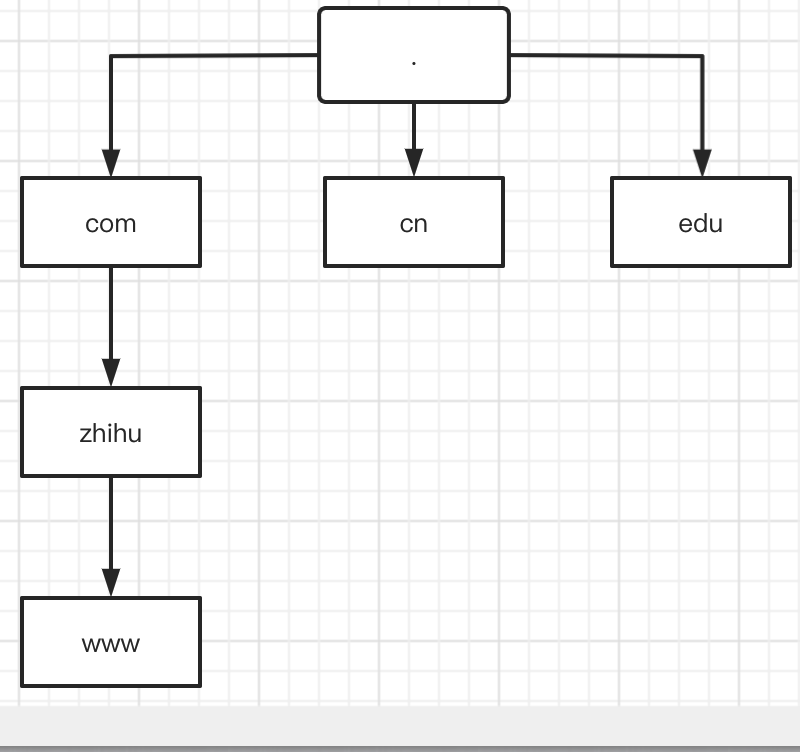


我们来看一下具体浏览器是如何找到服务器ip的

1. 浏览器请求最近的DNS查询，最近的DNS没有的话就去根服务器查（每个域名服务器都存储了根）
2. 根服务器发现没有该域名，但有上级域名com就返回上级域名com的ip地址
3. DNS服务器又根据com的ip访问，com又返回zhihu所在的ip地址
4. zhihu域的dns查询到www域名ip
5. 在www域名下找到了真实服务器的ip
6. 浏览器拿到最终ip后直接请求服务器

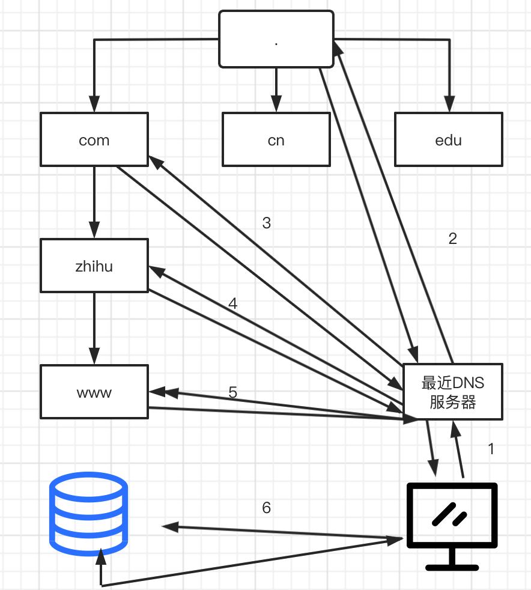


补充知识

> 上面的流程里面分为了迭代查询和递归查询
>
> 递归查询：也就是浏览器请求最近DNS后，就交给DNS去查找了，自己等待就行
>
> 迭代查询：DNS每次查询不同域名的DNS服务器后会收到另外一台的ip地址，再去重新请求另外一台的地址


并且上面的DNS查询流程，每个DNS服务器都做了映射缓存加快查询速度，一般我们也会在本地的**hosts**文件里配置一些基本的映射关系，经典的如`localhost 127.0.0.1`


### 1.3、浏览器委托访问

> 浏览器委托底层的socket来向服务器发送请求

描述符：应用程序用来识别套接字的机制（单台主机内部）

IP地址和端口号：客户端和服务器互相识别对方的套接字机制


## 2、TCP/IP传输数据

#### 2.1 TCP

主要分为五个步骤

1. 创建套接字
2. 建立连接
3. 收发数据
4. 断开连接
5. 删除套接字


##### 2.1.1 套接字

> 仅是一个逻辑概念，包含了一些列控制通信操作的控制信息（ip地址、端口号等）


##### 2.1.2 创建套接字

应用程序调用socket时候就会在内存空间开辟一个位置存放控制信息，因为还没建立连接，先写入初始化信息


##### 2.1.3 建立连接

客户端与服务器建立连接的时候，客户端的套接字需要写入服务器的ip和端口号，才能告知协议栈与谁进行通信

同时服务器监听自己端口，等待客户端连接进来提供自己的ip和端口号给服务器，服务器记录下信息到套接字中


###### 2.1.3.1 TCP头部

之前我们所说的控制信息是放在套接字中，用来控制协议栈操作的

现在所说的是，发送数据时候需要携带的一些必然的控制信息（TCP头部）

| 发送方端口 |                                                 |
| ---------- | ----------------------------------------------- |
| 接收方端口 |                                                 |
| 序号       | 发送的第多少个数据                              |
| 确认号     | 确认号之前的数据已经收到                        |
| 控制位     | ACK：确认号控制为  SYN：同步确认  FIN：断开连接 |
| 窗口       | 告诉发送方窗口大小                              |
| 校验和     |                                                 |


###### 2.1.3.2 实际过程

1. 客户端在TCP头部写上服务器的端口和自己端口等控制信息，发送个IP模块，IP添加头部控制信息（ip地址等）发送到下层网卡传输到网络
2. 服务器的IP模块收到后取出TCP数据块发送给TCP模块
3. TCP模块从头部取出端口号去找对应的套接字，然后修改套接字状态为正在连接


上面的操作流程就是三次握手的第一步，然后这里其实可以看到，每次双方其实是告知了对方的序列号的，序列号就是当前发送的第多少字节数据，**通过序列号和确认号确定了接收方是否收到数据**

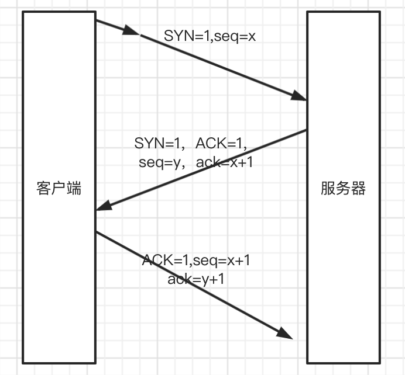

##### 2.1.4 数据收发

通过序列号、确认号和滑动窗口来控制数据的接受和发送


##### 2.1.5 断开连接删除套接字

> 在断开连接---四次挥手


这里服务器收到客户端的FIN后是先返回ACK告知客户端收到了，但这时为什么不直接发送FIN呢

> 因为这里服务器可能数据没有发送完毕需要在等待一段时间


同时我们看到下面发送ACK还等待了2MSL客户端才关闭为什么？

> 防止服务器没有收到ACK后，发送重传消息需要客户端重新传送保证服务器正常关闭。2MSL是包的最长生存时间


在关闭连接后，客户端套接字不会立马删除，因为为了防止我们上面说的服务器没有收到ACK，如果这时候我们删除了套接字，服务器重发FIN，这时候客户端已经没有了该套接字或者说重新分配了该端口给另外一个应用程序，这时候就会出现问题。所以套接字不会立马删除


##### 2.1.6 TCP接受数据流程

1. 一个主机向集线器所有的主机发送数据，主机会根据数据头部的MAC是否对应来接受
2. 接受后，会确认数据计算的FCS和尾部的FCS是否一致，不一致丢弃
3. 一致的话去掉MAC头尾，传给IP层，IP层会判断包头的ip地址是否与网卡相同
4. 相同就会把包的不同分片组装成原来的包，并去掉头尾传给TCP层
5. TCP根据端口号来找到对应套接字，根据套接字状态执行不同的操作


#### 2.2  UDP

> 没有TCP的接受确认和窗口机制，不需要交换控制信息也就不需要建立连接和断开连接。
>
> UDP协议只管发送数据，不管错误或者丢失


## 3、集线器、交换机和路由器

重点：

1. 信号如何在网线和集线器传输
2. 交换机转发
3. 路由器转发
4. 路由器附加功能


### 3.1 信号如何在网线和集线器传输

一般来说信号发送给集线器后，集线器会把信号发送给所有连接的主机上，主机自行根据MAC地址来判断收否接受

> 集线器是以太网架构，以太网架构规定包转发给所有设备，所有设备根据MAC判断接受


为什么连接线要用双绞线？

答：双绞线能抑制传输过程中产生的噪声防治失真。那么双绞线为什么能够抑制噪声呢？首先，我们来看看噪声是如何产生的。产生噪声的原因是网线周围的电磁波，当电磁波接触到金属等导体时，在其中就会产生电流。因此，如果网线周围存在电磁波，就会在网线中产生和原本的信号不同的电流。由于信号本身也是一种带有电压变化的电流，其本质和噪声产生的电流是一样的，所以信号和噪声的电流就会混杂在一起，导致信号的波形发生失真，这就是噪声的影响。***如果我们将信号线缠绕在一起，信号线就变成了螺旋形，其中两根信号线中产生的噪声电流方向就会相反，从而使得噪声电流抵消***


### 3.2 交换机转发

> 交换机根据内部维护的MAC地址表来转发包

具体来说MAC地址表映射了MAC地址和交换机的端口，发送过来的包判断其MAC与地址表的对应，然后转发到相应端口

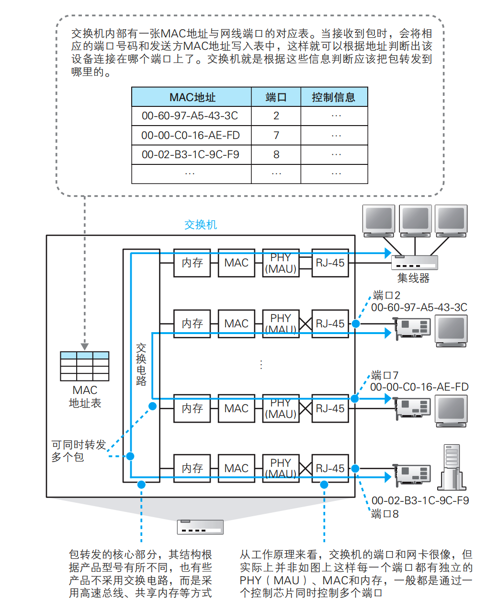


#### 3.2.1 交换机MAC地址如何生成和维护

每次有一个不再MAC地址表的包发过来的时候，MAC地址表就会把他添加进MAC地址，端口位流入进来的端口。下次有包要发送到该MAC地址就可以查找到对应端口。

当然MAC地址还需要删除那些设备移动的MAC地址，一般使用超时机制，比如某个MAC地址几分钟没有被使用就会自动过期。防止继续向某些已经不存在的MAC地址发送数据包


### 3.3 路由器转发

> 路由器内部也维护了地址表，只不过使用的是IP地址表，并且比交换机还要复杂

主要分为转发模块和端口模块，相当于IP模块和网卡

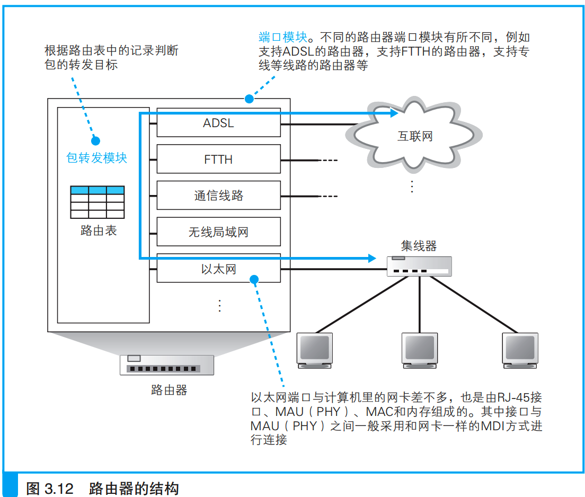


与以太网不同的是，路由器每个端口都有对应的MAC地址和IP地址，所以路由器在接受数据的时候，端口需要判断MAC地址是否对应，不对应就丢弃，这是与交换机所不同的。


#### 3.3.1 路由表信息

- 目标地址：下一跳传输的IP地址
- 子网掩码：网络号的长度
- 跃点数：距离大小

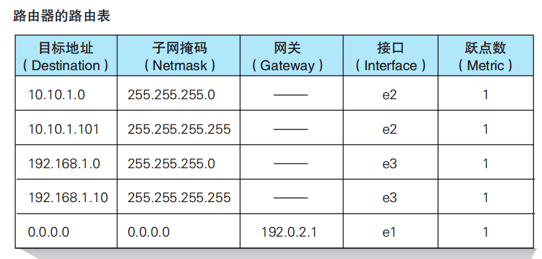


#### 3.3.2 路由包接受

1. 路由器在A端口接受数据后，判断A的MAC和包的MAC是否对应
2. 根据包的IP来查询路由表的IP，首先需要跟每个子网掩码得到网络号，根据最多前缀匹配规则来转发数据，选择长度最长的网络号转发，因为网络号越长，对应主机号越少，到达目标主机最快。
3. 当然如果多个目标地址网络号长度相同，就判断谁跃点数最小，来转发
4. 从目标端口出去封装MAC等信息，MAC地址的填写根据路由表的网关IP地址转换MAC地址填写，如果网关没有地址，就根据数据包的IP地址ARP后填写


#### 3.3.3 包的有效期

每个包都维护了一个TTL（生存时间），每经过一个路由器，TTL-1，直到为0的时候，那么该包直接丢弃。

一般包的TTL为64或者128


#### 3.3.4 路由器与交换机的关系

> 关系是基于IP和以太网的关系
>
> IP协议本身没有传输功能，因此包的实际传输是基于以太网协议的，路由器基于IP协议，交换机基于以太网协议

简单来说路由器负责将包发送给通信对象这一整体过程，交换机负责将包传输给下一个路由器的过程。


正是IP协议委托其他协议来传输数据，才使得出现各种灵活的通信协议，才构建出庞大的网络

这里其他协议可以使用无线局域网等


### 3.4 路由器额外功能

#### 3.4.5 地址转换

> 过去每个主机分配一个IP地址，IP地址消耗太快
>
> 采用地址转换，让一个公司等集体使用少数的IP地址，主机不再对应唯一IP地址

这样一来大部分内外设备使用私有地址，不能直接访问网络，通过路由器来私有地址转换为公有地址来访问互联网

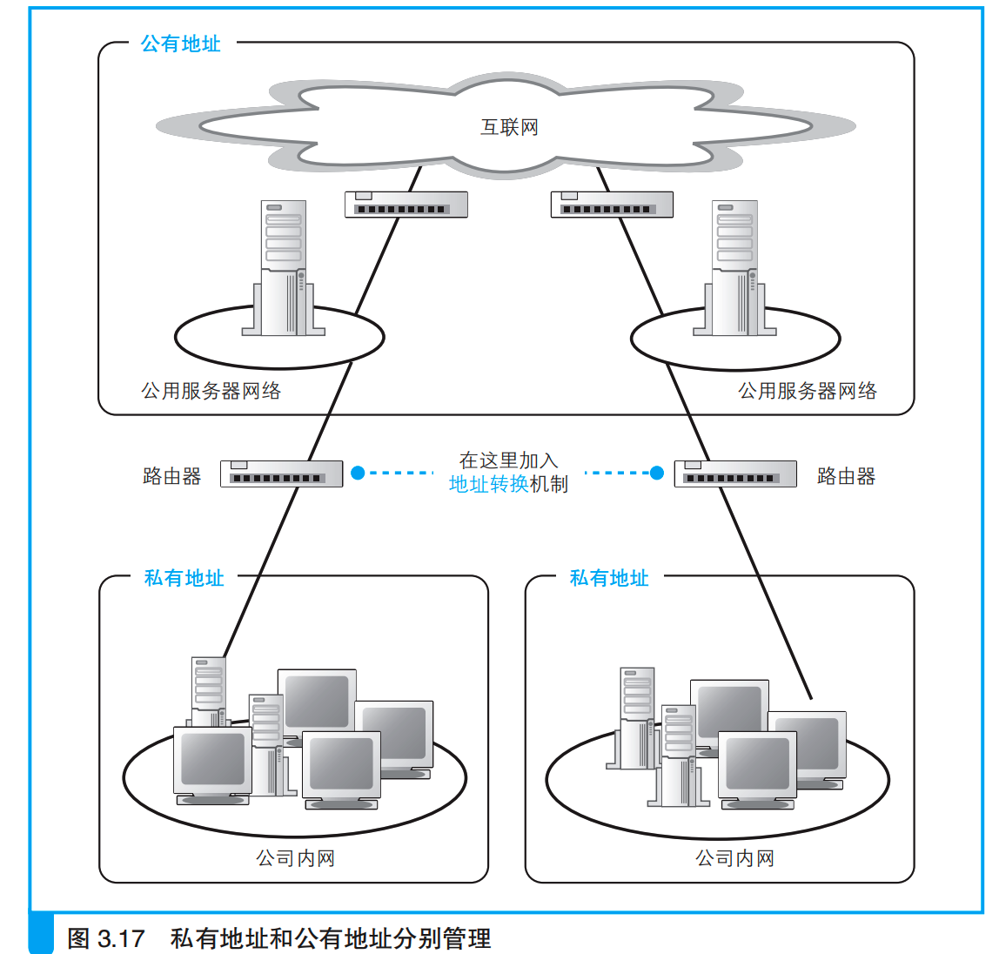


那路由器如何实现地址转换？

内部维护了一个地址和端口对应表，当有主机访问网络时候就填入表中，然后把主机发出的包的IP地址修改为表中的公有地址，当然还需要改写TCP头中的发送方端口号

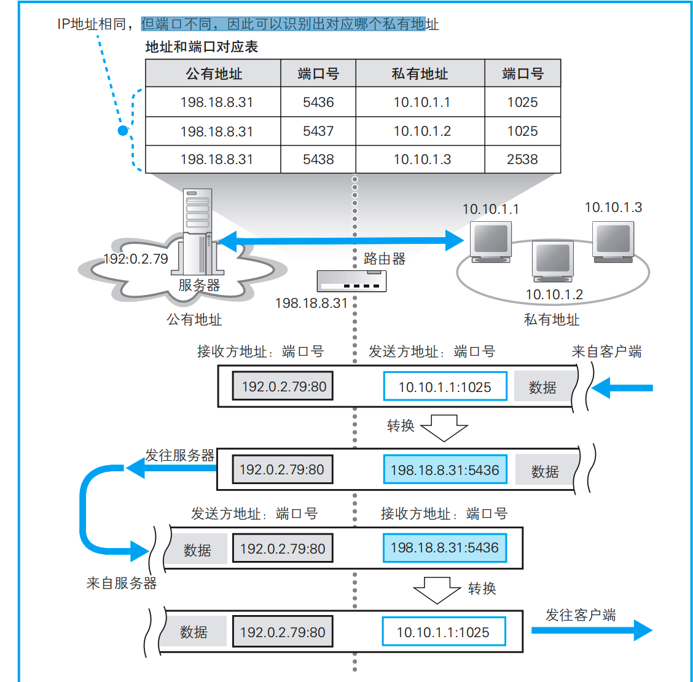


为什么需要改写端口号？

答：其实早期不需要端口，一个内网地址对应一个外网地址，但这样过于浪费外网地址。使用端口号来对应，会发现一个外网地址可以对应很多的（上万个）内网地址，可以达到很好的复用节约资源


在我们发送的时候路由表中没有该地址也能正常发送，而在接受的时候如果没有记录映射，那么就不能访问对应内网地址。这也就是说互联网中的主机想要主动访问内网是不可能的，除非我们主动添加记录到表中。


#### 3.4.6 过滤

> 根据MAC、IP和TCP包头来事先定好转发和丢弃规则
>
> 通常的防火墙等就是依靠的这个原理


## 4、接入网的内部

> 所谓接入网，就是指互联网与家庭等内网的通信线路，典型的如ADSL


### 4.1 接入网的结构和工作方式

按照规范，互联网接入路由器会在网络的包前添加MAC、PPPoE和PPP头

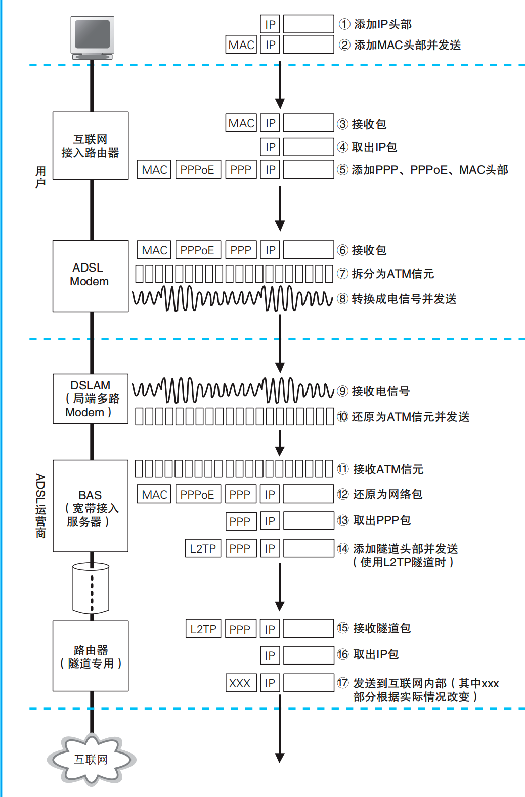

ASDL的上行（用户到互联网）和下行传输速率不同

原因在于上行所分配的信道频率低，低的话信号衰减小，不容易收到噪声影响


### 4.2 光纤接入网

光纤基本原理：将数字信号转换为电信号再转换为光信号传播。电信号也就是1高电压0低电压传入LED、二极管后，光源根据电压明暗发光，然后在光纤中传导。接收端根据光敏感元件来根据亮度转换为对应电压。


单模光纤：只能有一个光线传播。传播距离长，对接收端的设备要求高。	

多模光纤：多条光线传播。但不同角度光纤的反射不同，反射越大反射次数越多，传播距离越远，距离越远失真越大。

所以一般主要适用单模光纤。多模光纤用在同一个建筑内部


### 4.3 PPP和隧道

在ASDL和FFTH接入网中，都需要通过**BAS（宽带接入服务器，本质是路由器**）进行用户登录认证，该认证通过**PPPoE（以太网点对点）**协议来实现。而PPPoE又是基于**PPP**演化（传统电话拨号），通过拨号来获得IP信息


但PPP协议无法直接用于接入网。因为PPP协议没有定义以太网报头和FCS，因此无法直接传输，需要有包含上述东西的容器来传输，所以把PPP消息装入HDLC中，但接入网也不能使用HDLC，所以提出了一种新的协议PPPoE来方便在以太网传输

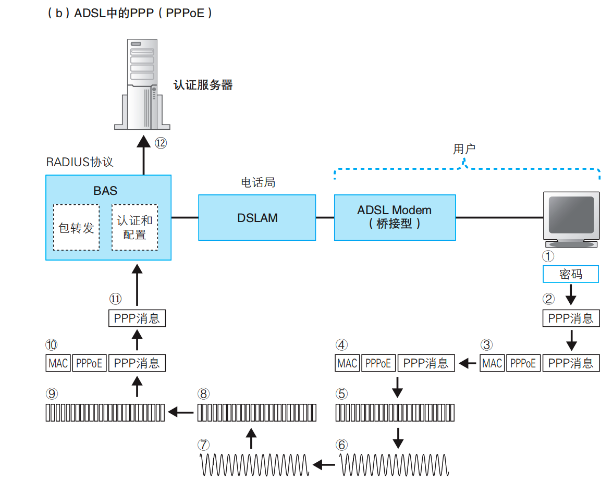

### 4.4 POP和NOC

POP（接入点）

> 首先是专线，这里用的路由器就是具有通信线路端口的一般路由器。专线不需要用户认证、配置下发等功能 A，因此用一般的路由器就可以了。接下来是电话、ISDN 等拨号方式的接入网，这里使用的路由器称为 RAS。拨号接入需要对用户拨电话的动作进行应答，而RAS 就具备这样的功能。此外，之前我们讲过通过 PPP 协议进行身份认证和配置下发的过程，RAS 也具备这些功能。再往下是 PPPoE 方式的 ADSL和 FTTH。PPPoE 方式中，ADSL、FTTH 接入服务商会使用 BAS，运营商的路由器则与 BAS 相连。PPPoE 中的身份认证和配置下发操作由接入服务商的 BAS 来负责，运营商的路由器只负责对包进行转发，因此这里也是使用一般的路由器就可以了。


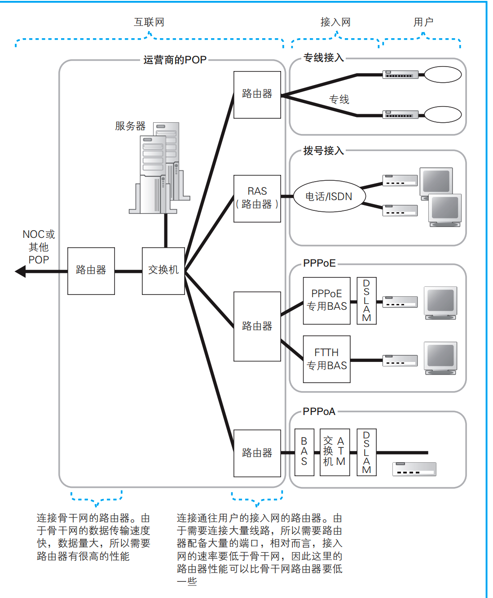

NOC是运营商核心设备

> 一般可以认为NOC是扩大后的POP


## 5、服务器端局域网

### 5.1 防火墙包过滤

> 包过滤方式的防火墙可根据接收方的IP地址、发送方IP地址、接收方端口和发送方端口号、控制位等信息来判断是否允许某个包通过。

比如禁止服务器往互联网发送请求（禁止控制位传输SYN=1，ACK=0）可以限制建立TCP三次连接


实际上，在防火墙允许包通过之后，就没有什么特别的机制了，因此包过滤并不是防火墙专用的特殊机制，而是应该看作是在路由器的包转发功能基础上附加的功能。只不过当判断规则比较复杂时，通过路由器命令难以维护这些规则。


### 5.2 负载均衡

> 当服务器访问增加时，仅靠增强单台服务器性能是不解决问题的，我们需要用多台服务器来分担流量，这就需要一个中间设备来讲客户端的请求分配给每台服务器，这就是负载均衡


要使用负载均衡，就需要把对应域名与负载均衡的IP绑定，注册到DNS中，客户端请求时候就发送给负载均衡，负载均衡根据算法（轮训、随机等）选择一个服务器把请求发给他来处理

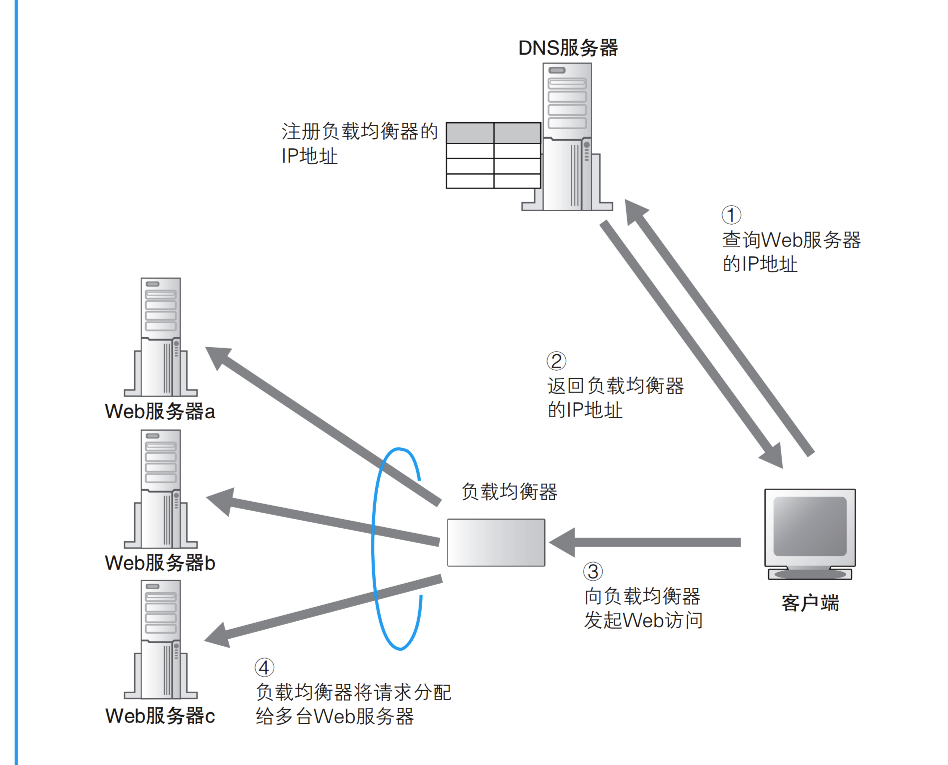


### 5.3 缓存服务器

> 有时候也可以通过缓存服务器来对数据（页面图片等）进行缓存来提高服务器的响应速度

WEB服务器需要进行各种访问权限，以及在页面填充数据后，消耗时间长。相对的，缓存服务器只把磁盘上对应文件返回给客户端而已，要更快


但是缓存是可能失效的，缓存服务器会与WEB服务器不一致

这时候如果缓存服务器有数据，那么他就需要请求WEB服务器数据是否有变化，没有变化就返回缓存，有变化就转发请求给WEB服务器

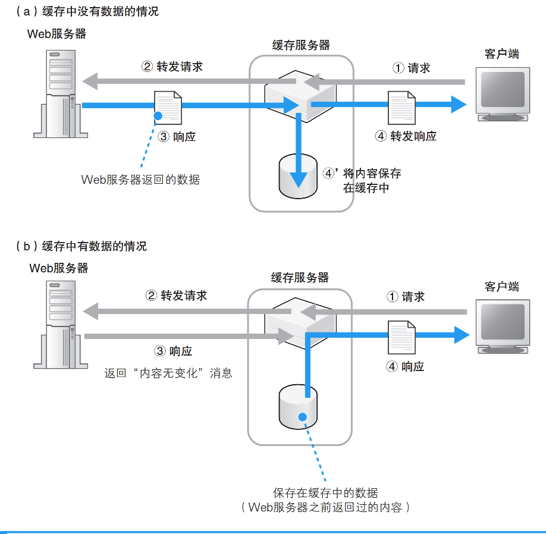


具体做法：

1. 缓存服务器请求头添加`If-Modified-Since`，值为上次保存时间，询问WEB服务器改时间之后数据变化
2. WEB服务器返回`304 not modifed`就表示数据没有修改

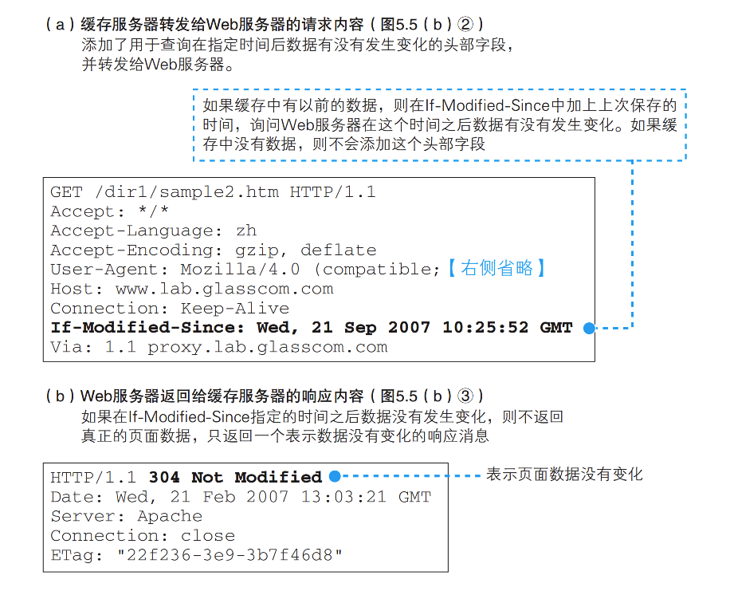


#### 5.3.1 代理

| 正向代理 | VPN等，隐藏客户端的信息               |
| -------- | ------------------------------------- |
| 反向代理 | 隐藏真实服务器，nginx负载均衡、缓存等 |


### 5.4 内容分发（CDN）

> 通过在运营商处部署服务器，一般缓存静态信息（页面、图片等），根据用户的IP分配最近的服务器

如何访问缓存服务器？

1. DNS根据路由表信息找到最近的服务器，通过估算客户端DNS服务器到缓存服务器距离，然后返回IP，计算距离不准确
2. 根据HTTP请求头的Location来重定向，通过重定向服务器来返回IP地址。优点通过估算IP地址到缓存距离，更准确。但是多了HTTP交互次数


## 6、请求到达服务器，服务器响应

### 6.1 服务器套接字

服务器在调用`accept`等待连接，当有连接来得时候，就会复制等待连接的套接字，复制的新的一份写入客户端IP和端口号，这个新的套接字就用来作为通信。

这里如果不创建新的副本，直接在原套接字上修改，那就没有套接字去等待新的连接了。这时候有新的客户端请求就无法处理。

> 但上面也会引入新的问题，每个副本端口号相同如何区分

一般套接字会有四个信息：客户端IP和端口、服务器IP和端口就可以唯一确定一个套接字

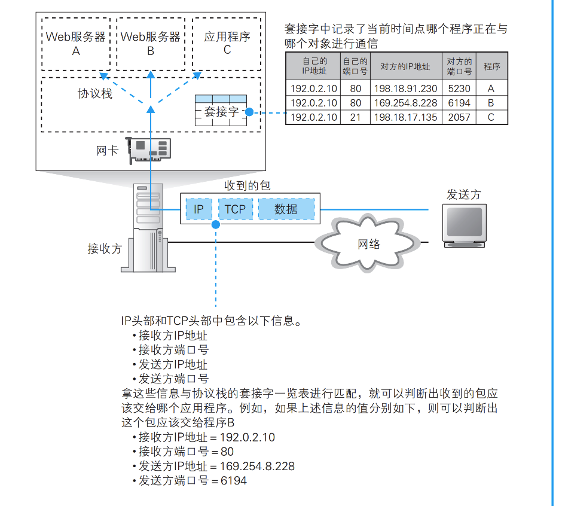


### 6.2 服务器接受操作

1. 网卡接受
   1. 网卡接受电信号，转换为数字信号
   2. 网卡MAC模块检测FCS，帧是否存在数据失真
   3. MAC模块检测MAC头是否与自己对应
   4. 使用中断通知CPU网卡缓存有数据，网卡驱动读缓存并调用对应上层协议栈软件
2. IP模块
   1. 检测IP头部的IP地址是否相同，不相同转发出去
   2. 查看是否分片，分片就合成原来的包
   3. 根据头部协议调用上层协议软件
3. TCP模块
   1. 检测TCP头部端口号
   2. 检测控制位（如果是SYN=1），那么就查看套接字是否有对应状态等待连接的，有的话复制套接字，设置建立连接，没有就通知错误。为套接字设置写入各种初始参数，同时分配缓存区
      1. 在处理数据包的时候，根据套接字当前的序列号计算下一个序列号，然后对应当前数据包序列号是否一致，一致就没有丢失，然后根据序列号和包长度生成确认号返回给客户端
4. 应用层
   1. 服务器根据请求的地址访问如果是页面一般文件就直接返回
   2. 如果是CGI程序就运行程序然后返回运行后数据

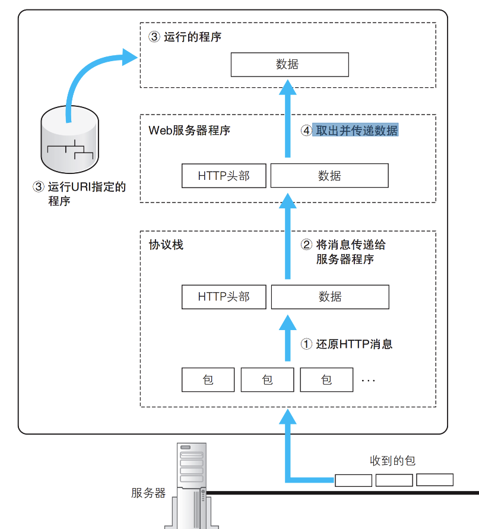
