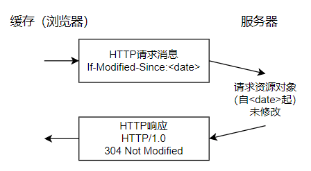
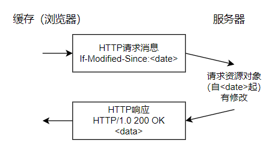

# 操作系统

## 汇编语言

数据-》通用寄存器-》段寄存器

### 寄存器

#### 	**通用寄存器**

   AX、BX、CX、DX**，存放一般性数据

​	32位CPU是EAX,EBX,ECX,EDX

​	AX可以分为AH和AL对应高8位和低8位，这是为了保证兼容性

​	一个字为16bit，等于2个字节、

​	CX一般存储程序的长度


​	SI和DI是跟BX功能相近的寄存器，但他们不能拆开为高位和低位

​	一般我们用ds:si指向要复制数据源，ds：di指向复制的目的空间

​	

​	 BP寄存器，在[]中使用他时候，如果指令没有显示给出段地址，默认为SS

​	如mov ax,[bp] 等价于ax=((ss)*16+(bp))


​	**段寄存器提供段地址：CS、DS、SS、ES**

​	CS和IP是CPU中最关键的寄存器，他们指示了CPU当前要读取的指令的地址

​		CS为代码段寄存器

​		IP为指令指针寄存器

   ds（数据）寄存器和AL配合组成地址，al的内容表示偏移地址，**注意8086CPU不支持将数据直接送入段寄存器**

​	ss（栈段寄存器）存放栈顶的段地址，寄存器SP存放栈顶的偏移地址


#### 标志寄存器


​		每个标志对应一个bit位，值为1就起到对应的作用

​		**ZF**指令记录相关计算结果是否为0，为0则ZF为1

​		**PF**指令记录相关计算结果对应bit位的1的奇偶性，0对应奇数，1对应偶数

​		**SF**记录相关计算结果为正数还是负数，为负，SF=1

​		**CF**记录相关计算结果进位标志，

​		**OF**记录溢出问题，溢出为1,

​		DF记录方向标志位，DF=0，每次操作后si,di递增，DF=1，每次操作后si,di递减

​	


### 段

将数据和栈还有代码分成不同的段，方便管理


### 指令

#### JMP

​	jmp 段地址 ：偏移地址  来修改CS:IP

​	jmp 偏移地址  仅仅修改IP


#### MOV

1、将数据直接送入寄存器 mov ax 1600H

2、将一个寄存器内容送入另一个寄存器	mov bx ax

3、将内存单元内容送入寄存器 mov al [0]

DW

定义字型数据dw define word

#### LOOP

s:表示loop循环开始的地方，执行到loop s时候会跳转到s:处，每次执行一次cx-1，直到cx=0处循环结束


#### **RET**

ret指令用栈中的数据修改CS:IP内容

CPU执行ret指令相当于 pop Ip

CPU执行retf指令相当于pop ip;pop cs


#### CALL

call 标号    意思将当前IP压栈，转到标号处执行指令

一般与ret配合使用

其实ret相当于return 

call相当于调用函数


#### adc

带进位加法指令，利用了CF标志位记录的值

如adc ax bx 等价于 (ax) = (ax)+(bx)+CF


#### SBB

带借位减法指令，也是利用了CF标志位


#### CMP

比较指令，只影响标志位

如cmp ax ax 等价于(ax)-(ax)

影响如下：

 	ZF=1   PF=1  SF=0  CF=0 OF=0


cmp ax bx


### 伪指令

**segement和ends****

是定义一个段

如下图所示，前面的codesg是一个名字，这里的意思是代码段


**End**

是一个汇编程序的结束标记，编译器碰到该指令后就会结束编译


**assume**

假设某个段寄存器与下面的段关联（segement和ends包起来的内容）


**dup**

db 3 dup(0) 定义三个字节

意思为db 0,0,0

db 3 dup(0,1,2)

等价于 0,1,2,0,1,2,0,1,2


### 中断

中断向量表

CPU通过中断类型码在中断向量表中找到对应中断处理函数入口地址


中断处理程序运行时候，首先把标志寄存器(TF、IF值为0)、CS、IP入栈，之后再通过iret来依次出栈


#### int指令

int n n为中断类型码 


### 地址加法器

下面是16进制的情况，段地址*16，也就是向做移动一个位置再加上偏移地址

如果是2进制的话，段地址就向做移动4位


### 灵活内存访问

[bx+data]在bx地址基础上又加上data定位到新地址


SI和DI是跟BX功能相近的寄存器，但他们不能拆开为高位和低位

​	一般我们用ds:si指向要复制数据源，ds：di指向复制的目的空间

几种内存寻址方式：


### 汇编数据位置

#### 立即数

idata直接包含在机器指令中的数据

如mov ax,1

#### 寄存器

数据存储在寄存器中

mov ax,bx

#### 段地址加上偏移地址

指令处理的数据在内存中，【X】的格式用来表达偏移地址，段地址存储在某个段寄存器中

mov ax,[bx+8]


### 中断


## 初识

操作系统开机

​	首先BIOS映射检查硬件设备

​	之后运行引导扇区代码

​	在读入setup的扇区信息

​			扩展内存：内存超过1M就需要扩展，使得操作系统方便管理内存信息

​			切换到保护模式，因为在之前寻址是采用了CSIP来寻址，最多能16位地址，也就是1M，现在需要切换为32位地址

​			这时候的寻址就叫做GDT（全局描述表）


​	读入操作系统system其他模块

​	进入main函数


系统调用：


DPL（目标权限） >= CPL(当前权限)

数字越大权限越小

int指令是中断指令：

​	该指令会将cs中的CPL改为0从而进入内核

​	这是用户程序发起的调用内核的唯一方式


系统调用中断指令为**int 0x80** ,得到对应编号后需要查找**IDT**表找到对应代码


下图为调用printf时候的执行流程


## CPU

并发：一个人处理多件事

并行：多个人处理多件事


CPU的每个进程都由PCB来记录信息（程序计数器，其他寄存器），这样每个CPU在切换时候，就把相应PCB存入栈中，当切换回来的时候，再出栈加载相应信息恢复现场


### 线程

两个线程使用不同的栈，Yeild切换线程时候，就要切换栈


线程创建:

1、创建TCB

2、创建栈

3、把返回地址压入栈中，栈和tcb绑定


用户级线程切换

核心级线程切换（能发挥多核的优点）

**注意进程是没有用户级进程的**


核心级线程需要两套栈（内核栈和用户栈）


内核栈和用户栈关联


内核栈中断流程：

1、用户级线程中断

2、内核处理中断

3、切换TCB

4、内核级线程切换

5、用户级线程切换  


#### 同步方式

1. 互斥量：拥有互斥对象才能访问公共资源。确保不会多个线程访问
2. 信号量：允许多个线程访问资源。但需要控制访问的线程数量
3. 事件：通过通知机制保持多线程同步


### 进程

#### 通信方式

1. 管道：父子进程通信
2. 有名管道：任意进程通信，以磁盘形式存储
3. 信号：通知接受进程某个事件发生
4. 消息队列：先进先出的链表，以内核形式存储
5. 信号量：一个计数器，用于多进程对共享数据的访问，可以解决同步的问题并避免竞争
6. 共享内存：多个进程访问同一块内存空间
7. 套接字：用于网络通信


### 调度算法

1. 先到先服务
2. 短作业优先
3. 时间片轮转
4. 多级反馈队列：结合短作业进程和高优先级算法
5. 优先级


### 同步

信号量用来对临界资源进行控制

临界区的保护是对信号量的保护


临界区的实现分为软件和硬件

软件有Pertson算法（两个进程）和面包店算法(多进程)

硬件时间使用1、关中断和开中断，因为只有产生中断才会造成调度算法，没有调度算法就没有进程切换

​					2、硬件原子指令(Test and Set) java里面碰到过


### 死锁

四个必要条件

互斥使用、不可抢占、无线等待、请求和保持


解决死锁方法：

​	死锁预防：破坏死锁出现的条件

​	死锁避免：检查每个资源请求，如果造成死锁就拒绝

​	死锁检测：检查到死锁让一些进程资源回滚，让出资源

​	死锁忽略：完全不管死锁


## 内存

重定位最适合的时机是运行时定位，每执行一次指令都要从逻辑地址算出物理地址，基地址加偏移地址

每个进程都有自己的基地址，都存在PCB中，方便每次计算


### 交换


### 分段

但因为有些进程占用内存很大，内存空间很可能不够，引入分段，只把最重要的程序内存段放入内存中，需要的其他部分的时候再交换进来。

段的特点：每个段大小不一样，段按代码、数据、堆栈等区分

如果使用段的话，PCB就不在只存储一个基地址，而是存储一个段与基地址对应的表，也叫段表

操作系统的段表叫GDT，进程的段表叫LDT


### 分页

解决内存分区导致的内存效率问题

分页的特点：固定大小


分段和分页：物理内存用分页，逻辑内存用分段


### 虚拟内存

现代操作系统为每个程序分配自己的虚拟内存地址，当要加载程序的时候，CPU发出虚拟地址给MMU（内存管理单元）转换为真实内存地址，通过总线传给内存，由内存来读写需要的地址


虚拟内存是存储在磁盘上的，最小单位为页，叫虚拟页


#### 页表

内存管理单元翻译地址的时候，根据页表来查询，页表存储了虚拟页对应的物理页


##### 缺页

当MMU通过页表发现虚拟页没有找到对应物理页的时候，就会触发页中断，如果内存没有空间了，内核会通过页面调度算法，从里面选出一个页回写会磁盘，把对应的虚拟页设置到到物理页中，更新页表的数据


##### 快表

解决虚拟地址到物理地址的转换速度，快表是一个高速缓存，缓存了部分页表

查询优先查找快表，快表没有才去页表查照


##### 多级页表

引入多级页表主要目的是为了避免把全部页表一直放在内存占用空间，以时间换空间

为什么引入多级页表可以节省空间

1. 一级页表的某个页表项没有被使用，那么其对应的二级页表就不会存在
2. 根据局部性原理，只有很少部分的二级页表被使用，那么大部分可以放在磁盘上，被使用了才放到内存


#### 页面置换算法

- 先入先出算法
- LRU：最近最久未使用算法，淘汰最近没有被访问的页面
- LFU：最少使用算法，淘汰最少使用的页面


## I/O

### 描述符

linux中所有设备都是文件，当想要操作一个文件的时候，内核就会放回一个非负整数给应用程序，该非负整数就是描述符，唯一对应一个文件。由内核来管理


### 套接字

用来与另外一个进程进行跨网络通信的文件


# 计算机网络

## 应用层

### Http1.0和http1.1

#### 缓存处理

1.0时候服务器端使用**Expires**来标记某个响应体在该时间内的请求，都会获得缓存

服务器返回的响应体还包含了一个**Last- modified**标记请求资源的最后一次修改

浏览器请求时候会附带一个**If-Modified-Since**标签，询问改时间之前有没有修改，没有的话服务器返回304 not modified，去缓存中拿，如果修改了返回200和新数据






http1.1添加了cache-control增加了灵活性和扩展性


##### 连接方式

http1.0默认使用短连接，每次请求都需要重新建立连接,可以设置**Connection:  Keep-alive**为长连接

http1.1默认使用长连接，可以关闭**Connection: close**


##### host头处理

添加了host头，方便告诉服务器请求的主机名

```html
GET /home.html HTTP/1.1
Host: example1.org
```


### telnet

在可靠tcp协议之上，登录到其他服务器，telnet最大缺点之一所有数据但均以明文形式发送，如今都用ssh来代替telnet


## 网络层

### tcp

#### 三次握手


##### 第二次握手为什么回传ack，为什么要syn

因为接收端传回**ACK**给发送端是告诉其收到了信号，表达这条信道是通畅的，回传**SYN**是为了建立服务器到客户端的通信


##### 连接队列

TCP连接在被用于应用程序之前，会有两种状态

- 连接尚未完成但已经接收到SYN了
- 三次握手完成，且处于ESTABLISHED状态，但还未被应用程序接受


操作系统内部维护了两个队列来进行处理

1. SYN请求到达时候，查看max_syn_backlog，如果位于SYN_RCVD状态的连接数目（1000）超过这一阈值，就拒绝
2. 维护一个未被应用程序接受的backlong，一般为128


##### 超时与重传

tcp有两套机制来完成重传，一是基于时间（计时器），二是基于确认信息的构成（快速重传）


快速重传能更加及时有效的修复丢包情况。

快速重传算法：TCP发送端在观测到至少dupthresh个重复ACK后，即重传可能丢失的数据分组，而不必等待计时器超时。

一直重传某个ACK表明中间有数据丢失


##### 拥塞控制

针对丢包，我们使用快速重传在一定程度上能解决问题。但是在网络处于拥塞状态下，快速重传需要发送更多数据包，加大了网络的拥塞程度。

一般会想到减缓发送TCP包速度

进一步说当接受速率或网络传输速率过慢时，我们需要降低发送速率。需要在发送端引入一个窗口**控制变量**，确保发送窗口大小不超过接收端接收能力和网络传输能力。

反映网络传输能力的成为**拥塞窗口**，记为`cwnd`


###### 慢启动

> 在传输初始阶段，由于未知网络传输能力，需要缓慢探测网络可用资源，防止短时间大量数据注入导致拥塞

在没有丢包的情况下，每次`cwnd`能会乘以2倍，直到出现网络瘫痪

无论是慢开始还是拥塞避免就单，只要发送方判断网络出现拥塞，没有收到ACK，这时候会把`cwnd`置为1，慢开始门限设置为拥塞时的一半


###### 拥塞避免

> cwnd每次增长近似于成功传输的数据端大小，是线性增长，比慢启动缓慢的多


###### 快速重传

快速重传能更加及时有效的修复丢包情况。

快速重传算法：TCP发送端在观测到至少dupthresh个重复ACK后，即重传可能丢失的数据分组，而不必等待计时器超时。

一直重传某个ACK表明中间有数据丢失


###### 快速恢复

> 有时候拥塞比较轻微，只有少量包丢失
>
> 当执行快速重传后进入快速恢复阶段
>
> cwnd会置为一半

然后增加采用拥塞避免


#### 四次挥手

需要**ACK**和**FIN**

**FIN**用来关闭连接


##### time_wait

标识TCP将会等待两倍于最大段生存期MSL，避免客户端发送的ACK丢失，服务器在没有收到ACK时候会一直重传FIN


#### 可靠传输

1. 校验和：保持首部和数据的校验和，给接收端用来去确认
2. 流量控制：通过滑动窗口限制接受和发送的缓冲区大小
3. 拥塞控制：网络拥塞减少数据发送，宏观角度
   1. 维持一个拥塞窗口
      1. 四种算法
      2. 慢开始：当主机不知道网络情况时候，试探性地扩大窗口，每次加倍
      3. 拥塞避免：让窗口缓慢增大，每经过一个往返时间就把窗口+1
      4. 快重传和快恢复：如果没有这个算法，数据丢失后TCP就会使用定时器要求传输暂停，这时候没有数据可以发送。**有了该算法，接收方收到不按顺序的数据后他会立即给发送方发送一个重复确认，如果收到三个重复确认，他会重传这些丢失的数据，并且不会暂停**
4. ARQ协议：自动重传请求，每发完一个分组就停止发送等待确认（一般采用累积确认，对最后到达的序号分组发出确认）
5. 超时重传：用定时器绑定报文段，超时后重新传送数据