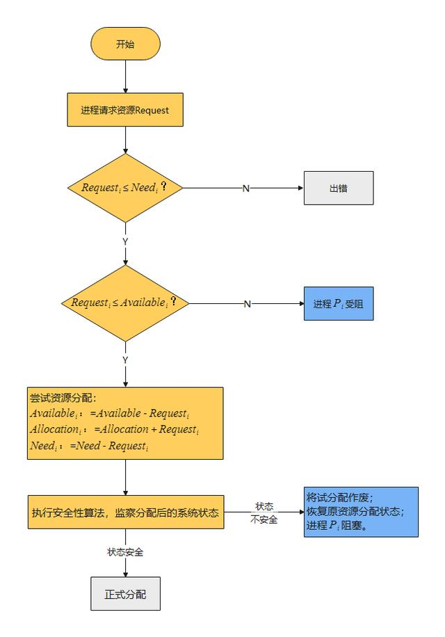
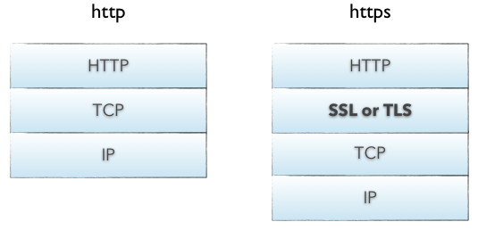
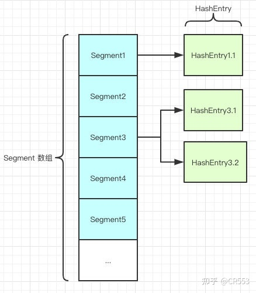

# 面试

## redis

1. 分布式锁的实现有哪些，分别怎么实现的，redis的具体实现以及操作
   1. setnx和del配合
      
      1. 如`SET lock_key random_value NX aPX 5000`
      
      
   
2. 设置分布式锁的时候，setnx 和 expire如果不能同时执行完会有什么影响

   1. setnx和expire是分开的两步操作，不具有原子性，如果执行完第一条指令应用异常或者重启了，锁将无法过期。

3. 如何实现setnx 和 expire的原子性操作

   1. 一种改善方案就是使用Lua脚本来保证原子性(包含setnx和expire两条指令)
   2. SET lock_key random_value NX aPX 5000

4. redis在删除锁的时候会发生什么，有什么操作需要执行

5. redis查找很慢如何排查问题

   1. 通过慢日志排查
      1. 经常使用 O(N) 以上复杂度的命令，例如 SORT、SUNION、ZUNIONSTORE 聚合类命令；
      2. 使用 O(N) 复杂度的命令，但 N 的值非常大。
   2. 不是上面的原因，而是因为set、del的话，是因为添加了bigkey，value特别大
      1. `redis-cli -h 127.0.0.1 -p 6379 --bigkeys -i 0.01`
      2. 执行如下命令扫描
      3. 也有可能是key集中过期

6. redis有哪些数据结构，分别在什么情况下使用

   1. string（[字符串](https://so.csdn.net/so/search?q=字符串&spm=1001.2101.3001.7020)），hash（哈希），list（列表），set（集合）及zset，bitmap

7. mysql数据库和redis缓存如何进行同步，数据库和redis缓存如何保证一致，同步过程中mysql宕机或者redis宕机怎么办，分布式锁

   1. **采用延时双删策略**

      1. `public void write(String key,Object data){ redis.delKey(key);
         db.updateData(data); Thread.sleep(500); redis.delKey(key); }`
      2. 延迟500毫秒是为了删除读请求给设置的脏缓存数据

   2. **异步更新缓存(基于订阅binlog的同步机制**）

      1. MySQL binlog增量订阅消费+消息队列+增量数据更新到redis
      2. 读Redis：热数据基本都在Redis写MySQL:
      3. 增删改都是操作MySQL更新Redis数据：
      4. MySQ的数据操作binlog，来更新到Redis

      这样一旦MySQL中产生了新的写入、更新、删除等操作，就可以把binlog相关的消息推送至Redis，Redis再根据binlog中的记录，对Redis进行更新。

      一般可以结合阿里的canal，消息队列用kafka

8. redis数据结构， key的过期时间是怎么设定的（原理）

9. zset在哪些场景下会使用

   1. Redis 中 zset 不是单一结构完成，是**跳表和哈希表**共同完成

   2. #### 1. 延时队列

      zset 会按 score 进行排序，如果 score 代表想要执行时间的时间戳。在某个时间将它插入zset集合中，它变会按照时间戳大小进行排序，也就是对执行时间前后进行排序。

      

      起一个死循环线程不断地进行取第一个key值，如果当前时间戳大于等于该key值的socre就将它取出来进行消费删除，可以达到延时执行的目的。

      #### 2. 排行榜

      经常浏览技术社区的话，应该对  “1小时最热门” 这类榜单不陌生。如何实现呢？如果记录在数据库中，不太容易对实时统计数据做区分。我们以当前小时的时间戳作为 zset 的  key，把贴子ID作为 member ，点击数评论数等作为 score，当 score 发生变化时更新 score。利用 `ZREVRANGE` 或者 `ZRANGE` 查到对应数量的记录。

      #### 3. 限流

      滑动窗口是限流常见的一直策略。如果我们把一个用户的  ID 作为key 来定义一个 zset ，member 或者 score 都为访问时的时间戳。我们只需统计某个 key  下在指定时间戳区间内的个数，就能得到这个用户滑动窗口内访问频次，与最大通过次数比较，来决定是否允许通过。

10. 跳表讲一下，源码看过吗

    1. 

       

       

       

       

11. redis如何实现高可用，为什么采用单线程，

    1. 

12. 读多写少什么数据结构，读少写多什么数据结构

13. redis集群模式，内存淘汰机制，lfu，分片集群模式

    1. 内存淘汰
       1. 

14. 缓存穿透、缓存击穿、缓存雪崩

15. 如何用缓存，redis的基础数据结构，判断用户是否登陆用什么数据结构

    1. bitmap

16. 布隆过滤器

    1. Bloom Filter跟单哈希函数Bit-Map不同之处在于：Bloom Filter使用了k个哈希函数，每个[字符串](https://so.csdn.net/so/search?q=字符串&spm=1001.2101.3001.7020)跟k个bit对应。从而降低了冲突的概率。
    2. 

## JVM

1. synchronized和lock区别，synchronized，lock是否公平，公平锁概念，可重入锁，可重入锁最大的好处什么，自旋锁，自旋锁弊端和优点
   1. 可重入锁解决死锁
   2. 自旋锁缺点：可能一直空转占用CPU，优点：在其他线程很快结束下，不用cpu上下文切换
2. 垃圾收集器，CMS垃圾回收过程
3. jvm调优工具，jvm调优经验，jvm out of memory怎么调优
   1. 内存泄露的话用jmap生成dump放到Visual VM或者Mat
4. jvm GC过程
5. GC算法与各项垃圾收集器的对应
6. 类加载过程，类加载过程中如何解决循环引用问题
7. GC算法及应用场景
8. 垃圾收集器以及收集过程，CMS和G1，jdk1.8之前和jdk1.8之后gc的变化
9. 堆和栈区别，元空间放在哪的
10. jvm内存空间，内存分配机制
11. gc会带来什么问题，如何避免，gc是线程粒度还是进程粒度
12. 如果一个对象计算过hashcode值了，还能发生锁膨胀变为偏向锁吗？
    1. 不能，偏向锁会用线程id和epoch值覆盖hashcode
    2. 轻量级锁和重量级锁都会在线程的栈里面创建一块专门的空间**Displaced Mark Word**，用于在获得锁的时候，复制“锁”的对象头里面的Mark Word内容，把当前的线程ID写进Mark Word
13. 圾回收算法，新生代垃圾回收为什么采用复制算法，CMS流程，CMS中老年代对象引用了新生代对象，如何避免老年代全部扫描
14. jvm内存结构，对象创建过程，对象晋升，垃圾收集器，可达性分析根对象，哪些区域会出现OOM，类加载过程，双亲委派机制的目的
15. java内存布局，哪些垃圾清理算法，标记清理过程，哪些是GC roots，有哪些类加载器，什么时候会打破双亲委派机制，JDBC驱动加载过程，GC时用户线程暂停是存储在哪里

## mysql

1. 隔离级别，以及会产生的问题，脏读，不可重复读，幻读等什么时候会出现
   1. 脏读读到了没有另外一个事务提交的数据
   2. 一个事务先读一次，下一次读数据内容变化了
   3. 幻读是一个事务两次读后，数据的数量有变化，多了或者少了
2. 几种索引介绍
   1. 聚簇
   2. 普通
   3. 唯一
   4. 组合
3. 索引失效以及生效情况介绍，like什么时候不会失效
4. 为什么采用B+树，B+树优点，B+树和B树的最大区别，除了叶子节点上的区别，非叶子节点的最大区别
   1. B+树的数据都存储在叶子结点中，分支结点均为索引，查询时只需要扫描叶子节点，常用于数据库索引；
   2. B树其分支结点和叶子节点都存储着数据，查询时需要进行一个遍历，常用于文件索引；
5. InnoDB和myIsam对比
   1. 支持事务
   2. 支持行级锁
   3. 支持外键
6. 可重复读如何实现
7. mysql锁介绍
   1. 主要行锁
      1. 分为了两种类型：共享锁和排他锁
      2. 还有意向锁：也分为了意向共享和排他
      3. 使用索引才会用到行锁
      4. 间隙锁防止幻读
8. 乐观锁 悲观锁
   1. 上面的锁基本都是悲观锁
   2. 乐观锁根据版本来控制，乐观锁每次在执行数据修改操作时，都会带上一个版本号，一旦版本号和数据的版本号一致就可以执行修改操作并对版本号执行 +1 操作，否则就执行失败
9. mysql事务隔离级别，默认隔离级别，幻读是怎么解决的，mvcc
10. mysql select语句执行顺序，mysql是如何运行的，优化器如何基于什么原则优化
11. mysql事务隔离级别，如何实现各种隔离级别
12. mysql主从复制原理，什么情况会出现数据不同步问题
13. mysql 一句sql语句具体执行过程，如何看是否用了索引，explain的原理是什
14. mysql的锁有哪些，myisam为什么不支持行锁，innodb是如何实现行锁的
15. a是主键索引，b是普通索引，c是普通字段，有数据1 1 1， 5 5 5， 10 10 10，update b where c=5会使用表锁还是行锁
    1. 表锁，c没有索引
16. A事务在update c where b=xxx，但是A事务未提交，此时B事务insert 3 3 3 能够插入进去吗？（间隙锁会起作用吗）
    1. 可以插入
17. myisam和innodb的区别，myisam为什么采用表锁，innodb为什么能够支持行锁，行锁会出现死锁的情况，场景是？
18. mysql隔离级别，分别解决什么问题，什么是幻读，默认是什么隔离级别，如何修改隔离级别，删除数据怎么删，为什么采用逻辑删
19. mysql为什么采用B+树而不是B树，为什么主键要自增长，如果没有主键怎么办（主键选取机制），主键用完了怎么办，覆盖索引

## 计算机网络和操作系统

1. tcp和udp区别，tcp保证可靠传输的机制，拥塞控制的方式，tcp粘包，

2. http和https区别，https和http哪个快，端口号，、

   1. https的端口为443

3. tcp三次握手，最后一次握手没成功怎么办，四次挥手time_wait

   1. 
   2. 四次挥手的time_wait等待2MSL，保证客户端发搜到那个ACK能到达服务器
   3. 最后一次握手没成功会，服务端会根据重传机制重新发送SYN和ACK。如果一定次数没有收到关闭连接。此时客户端是显示成功的。服务器关闭后发送FIN告诉客户端关闭

4. DNS协议,DNS查找迭代和递归方式

   1. **递归**：[客户端](https://www.zhihu.com/search?q=客户端&search_source=Entity&hybrid_search_source=Entity&hybrid_search_extra={"sourceType"%3A"article"%2C"sourceId"%3A"61394192"})只发一次请求，要求对方给出最终结果。**迭代**：客户端发出一次请求，对方如果没有授权回答，它就会返回一个能解答这个查询的其它名称[服务器列表](https://www.zhihu.com/search?q=服务器列表&search_source=Entity&hybrid_search_source=Entity&hybrid_search_extra={"sourceType"%3A"article"%2C"sourceId"%3A"61394192"})，
   2. **客户端-本地dns服务端：这部分属于递归查询。（定义）****本地dns服务端---外网：这部分属于迭代查询**

5. 网络七层结构，传输层有什么协议，应用层有什么协议，ftp了解吗

6. 进程状态，状态转化

7. 进程间通信方式

8. 守护线程，僵尸进程，孤儿进程讲解下

   1. 孤儿：父进程在子进程退出前结束。
   2. 僵尸：子进程退出状态不被收集，发送内存泄露
   3. 守护：后台悄悄执行

9. linux查看进程命令，想考察linux上的开发(直接不会)

   1. 查看tomcat:tail -f catalina.out
   2. ps -a

10. 死锁概念，死锁产生原因，如何避免死锁，除了破坏四个条件呢，预先分配资源（类似银行家算法）

    1. 

11. http协议传输图片怎么传输

    1. Content-type: multipart/form-data

12. https加密和解密具体过程以及算法，怎么传输秘钥

    1. 客户端发送可用的对称算法集，服务端返回一个对称算法和自己的证书（包含公钥）
    2. 客户端验证服务端证书生成私钥，利用证书公钥对私钥签名，服务端使用证书私钥解密出对称私钥
    3. 客户端利用对称私钥加密发送数据

13. 在浏览器输入一个网址敲下回车后发生了什么，如果是基于数据传输会怎么样

    1. \1. DNS解析 

       \2. TCP连接 

       \3. 发送HTTP请求 

       \4. 服务器处理请求并返回HTTP报⽂ 

       \5. 浏览器解析渲染⻚⾯ 

       \6. 连接结束

14. https底层传输过程

    1. 

    2. 客户端发送可用的对称算法集和随机值1，服务端返回一个对称算法，一个随机值2和自己的证书（包含公钥）

    3. 客户端验证服务端证书生成预主密钥，根据随机值1和2和预主密钥合成对称私钥，利用证书公钥对数据部分（私钥）签名，服务端使用证书私钥解密出对称私钥

    4. 客户端利用对称私钥加密发送数据，如果服务器返回数据代表密钥传递成功

    5. 那么如何保证证书没有被伪造

       1. 验证证书安全性过程

           当客户端收到这个证书之后，使用本地配置的权威机构的公钥对证书进行解密得到服务端的公钥和证书的数字签名，数字签名经过CA公钥解密得到证书信息摘要。
           然后证书签名的方法计算一下当前证书的信息摘要，与收到的信息摘要作对比，如果一样，表示证书一定是服务器下发的，没有被中间人篡改过。因为中间人虽然有权威机构的公钥，能够解析证书内容并篡改，但是篡改完成之后中间人需要将证书重新加密，但是中间人没有权威机构的私钥，无法加密，强行加密只会导致客户端无法解密，如果中间人强行乱修改证书，就会导致证书内容和证书签名不匹配。
       

    

15. 

16. TCP三次过程，为什么要三次握手不是两次，如果两次握手会怎么样

    1. 如果是两次握手，因为tcp是全双工，服务端不能保证客户端能够正确接收到消息，而且如果遇到DOS的会，服务端不会断开连接

17. http状态码，4XX代表什么，5XX代表什么，502是什么，504是什么，499是什么

    1. 4xx客户端错误,500服务器错误.504网关超时，502是网关错误、499客户端主动断开

18. OSI模型，socket在哪一层，跟tcp/udp的关系

    1. 表示层，基于tcp/udp

19. OSI七层模型，应用发送数据是如何从上往下的

    1. 展示层，把应用层数据转换为字节流，传输层分组加序号传给下层加端口，网络层封装成数据报，加IP，传给数据链路层封装成帧加MAC，下层传给物理层

20. tcp建立连接后，对端断网了，连接还在吗？建立连接后两端一直处于在线状态，tcp连接会一直在吗？

    1. 有超时机制，心跳机制

21. tcp发送1234567的数据包到对端，对端一直回复3的包，此时发送方会怎么样

    1. 重传34567

22. ip包在转发过程中，如果一直无限跳下去，会怎么样

23. ip包在转发过程中是如何找到mac地址的

    1. ARP，发送ip广播到主机上，对应主机回应mac地址

24. get和post区别

    1. 首先，使用目标不同：GET方法只是用来查询，不会对浏览器上的信息产生影响，每次GET的方法都是相同的

       其次，大小不同：GET是放在URL首部，因此大小随着浏览器而定，而POST则是在报文中，只要没有具体限制，文件的大小是没限制的

       然后，安全性不同：GET采用的是明文传输，而POST是放在报文内部，无法看到

       从使用场景的角度来说，一般像用户注册登录这种信息都是私密的，采用POST，而针对查询等，为了快速，大多采用GET传输。

       （关于关于GET和POST的区别，最近重新看了很多别人写的博客啊资料什么的，发现上面的解释比较模糊，我就在下面的评论区里面将区别清晰的描述一下，当然，后面的博客也会详细的解释

## 多线程

1. 线程池参数，为什么新的任务来了不直接创建线程要先放入工作队列
2. 进程与线程区别
3. stringBuilder和StringBuffer区别，StringBuffer如何实现线程安全
4. 如何实现同步，多线程之间的通信，ABA问题出现的原因
   1. aba:由于 CAS 设计机制就是获取某两个时刻(初始预期值和当前内存值)变量值，并进行比较更新，所以说如果在获取初始预期值和当前内存值这段时间间隔内，变量值由 A 变为 B 再变为 A
   2. 同步：当使用多个线程来访问同一个数据时，非常容易出现线程安全问题(比如多个线程都在操作同一数据导致数据不一致)，所以我们用同步机制来解决这些问题。
   3. 线程通讯：当使用synchronized来修饰某个共享资源时(分同步代码块和同步方法两种情况)，当某个线程获得共享资源的锁后就可以执行相应的代码段，直到该线程运行完该代码段后才释放对该共享资源的锁，让其他线程有机会执行对该共享资源的修改。当某个线程占有某个共享资源的锁时，如果另外一个线程也想获得这把锁运行就需要使用wait()和notity()/notityAll()来进行线程通讯了。
5. 线程池的参数，不考虑内存的情况下为什么要采用阻塞队列
   1. 当阻塞队列为空的时候，需要去拿任务执行，但现在没有任务就要让当前线程阻塞等待任务
6. synchronized和Lock的区别，一个类有两个方法都用synchronized修饰，两个对象分别调用这两个方法能够执行吗
   1. Lock是jdk提供，sync是jvm底层，jvm在1.6之前重量，后面jvm提供了很多优化。Lock可以尝试获取锁，不用一直等待，必须要在finally中释放锁
   2. 如果两个方法都是实例方法，两个对象实例分别调用那么可以执行，因为锁不一样
   3. 如果分别是静态和实例，也可以，因为一个是对象锁，一个是类锁
   4. 如果都是静态，那么不可以
7. synchronize实现原理，锁膨胀
   1. 如果线程竞争激烈，锁升级为重量级，也就是获取monitor对象
8. cas会出现什么问题（ABA），cas如何保证原子性的
   1. 利用了CMPCHG指令，并且变量设置为volatile保证可见性和防止指令重排序
9. synchronized和ReentrantLock的区别，ReentrantLock是如何上锁的，ReentrantLock如何实现可重入锁
   1. Ree底层通过CAS保证、volatile。仅仅添加state状态+1来保证可重如
10. 线程状态
    1. new->可运行-运行-》阻塞-》等待-》死亡
11. 操作系统进程调度算法，什么时候会出现死锁，如何解决死锁，进程饥饿是什么
12. 一个非线程安全的list，一个线程添加1，一个线程添加2，主线程打印list，最后结果是什么
13. 如何实现并发，有哪些操作
14. 线程状态以及之间的转换
15. ReentrantLock获取锁时没获取到会进入阻塞状态吗
    1. 如果设置了超时，会有限阻塞，如果没有那么不会阻塞

## java基础

1. 反射，反射概念，new和反射创建对象哪个效率高
2. synchronized和lock区别，synchronized，lock是否公平，公平锁概念，可重入锁，可重入锁最大的好处什么，自旋锁，自旋锁弊端和优点
3. 浅拷贝和深拷贝，如何实现深拷贝，如果嵌套多层怎么实现，不用递归怎么做呢
   1. 实现深拷贝 实现Clone接口
   2. 嵌套使用序列化，[序列化](https://so.csdn.net/so/search?q=序列化&spm=1001.2101.3001.7020)就是将对象写到流的过程，写到流中的对象是原有对象的一个拷贝，而原对象仍然存在于内存中。通过序列化实现的拷贝不仅可以复制对象本身，而且可以复制其引用的成员对象，因此通过序列化将对象写到一个流中，再从流里将其读出来，可以实现深克隆。需要注意的是能够实现序列化的对象其类必须实现Serializable接口，否则无法实现序列化操作。
4. hashMap：数据结构，为什么链表转树8，树转链表
5. 多线程和单线程区别
   1. 提高cpu利用率

6. 高并发相关概念
   1. qps每秒请求数
   2. 吞吐量：单位时间内处理请求数
   3. 响应时间：处理一个请求所需时间
   4. 压力测试ab

7. 设计模式-装饰者模式
   1. 增强现有类所没有的功能，如java的io包
   2. 在不改变原有继承类方法的基础上，增加新的功能

8. 观察者模式，应用场景
   1. 用于回调
   2. 当一个对象状态改变时候，通知所有监听他状态的对象

9. hashMap put过程
   1. 如果对应数组node没有值就放进去，如果有值的话就判断是不是树节点，如果是添加到红黑树中
   2. 如果是普通节点，放到链表尾部，如果链表长度超过8
   3. 那么就先判断数组是否小于64，是的话扩容数组（乘以2）
   4. 不是的话变成红黑树

10. 手撕基于数组的队列，实现先入先出，动态扩容。
11. 常用集合介绍，各种集合使用场景
    1. Set、List、Map

12. 反射应用场景
    1. 动态生成各种类，各大框架spring的aop，mybatis的mapper，dubbo根据SPI机制扩展类
    2. 动态代理aop

13. 多态，不局限于方法，利用多态子类如何使用父类属性
    1. 属性不具有多态
    2. 方法内

14. hashMap和hashtable区别，hashMap底层结构，为什么扩容是2倍扩容
    1. hash计算时候用的(n-1)&hash.   n表示容量，为2的幂次方
    2. 比如n为16，那么二进制位10000，n-1后二进制位01111
    3. 之后去&上其他数字就可以减小碰撞了,通过位与代替模运算

15. C++虚类跟java接口的区别
    1. 虚类相当于抽象类

16. java线程池长度如何确定
    1. 涉及IO密集和CPU密集
    2. CPu密集推荐线程数为N+1，当一个线程刚好因为错误的时候，额外的线程可以确保CPu周期不断
    3. IO密集型推荐2N
    4. 还有最后一种需要知道CPU数量和CPu使用率，并且得出等待时间与计算时间的比率W/C
       1. 线程数 = n_cpu * u_cpu * (1+W/C)

17. 多态是如何实现的
18. hashMap结构，为什么要小于6才变为链表而不是8，为什么容量是2的幂次
19. hashtable和concurrentHashMap区别
20. 线程安全的list有哪些
    1. Vector
    2. copyonArrayList
       1. 用的可重入锁，每次添加元素复制底层数组长度+1

    3. Collections的静态方法synchronzied

21. hashMap底层数据结构，put流程，为什么要采用红黑树
    1. 冲突节点过多的话，链表遍历是o(n)，而红黑树是log(n)，提升hashmap查找效率

22. hashtable，concurrentHashMap区别
    1. 第一个全表锁，效率低下
    2. jdk1.7下面的segement继承了可重入锁，称为分段锁
    3. 
    4. 在1.8采用了cas和synchroized来保证并发，hashEntry改为了Node
    5. 首节点用CAS保证，在链表和红黑树中修改用Synchroized保证

23. Fail-fast和fail-safe
    1. java传统的collection下的集合都是fail-fast，跟迭代器有关，内置modcount，如果有其他线程修改，线程调用next的时候，modcount就会改变不与expect一样，直接报错，并且会出现aba问题
    2. java的juc包下的都是fail-safe，他们复制了一份出来遍历

## 框架

1. spring解决循环依赖（setter注入）
   1. 

## 算法

1. **二分**
2. **链表反转**
3. **手撕基于数组的队列，实现先入先出，动态扩容。**
4. **算法题：求数组中最小的k个数**
5. 多线程交替打印1-100，一个线程打印奇数，一个线程打印偶数
6. 两个无序数组合并成有序数组
7. 做题，区间合并
8. 两个栈如何实现队列
9. dfs实现字符串反转
10. 归并排序时间复杂度怎么算
11. 如何判断一个数是否是2的幂次方， n&（n-1）
12. 扫雷游戏，10*10，10个雷，如何保证每个雷随机落在每个点上概率相同
13. 算法：两个队列实现栈，一个大小为n的数组，里面元素为0-n-1，必定有重复，找出重复项